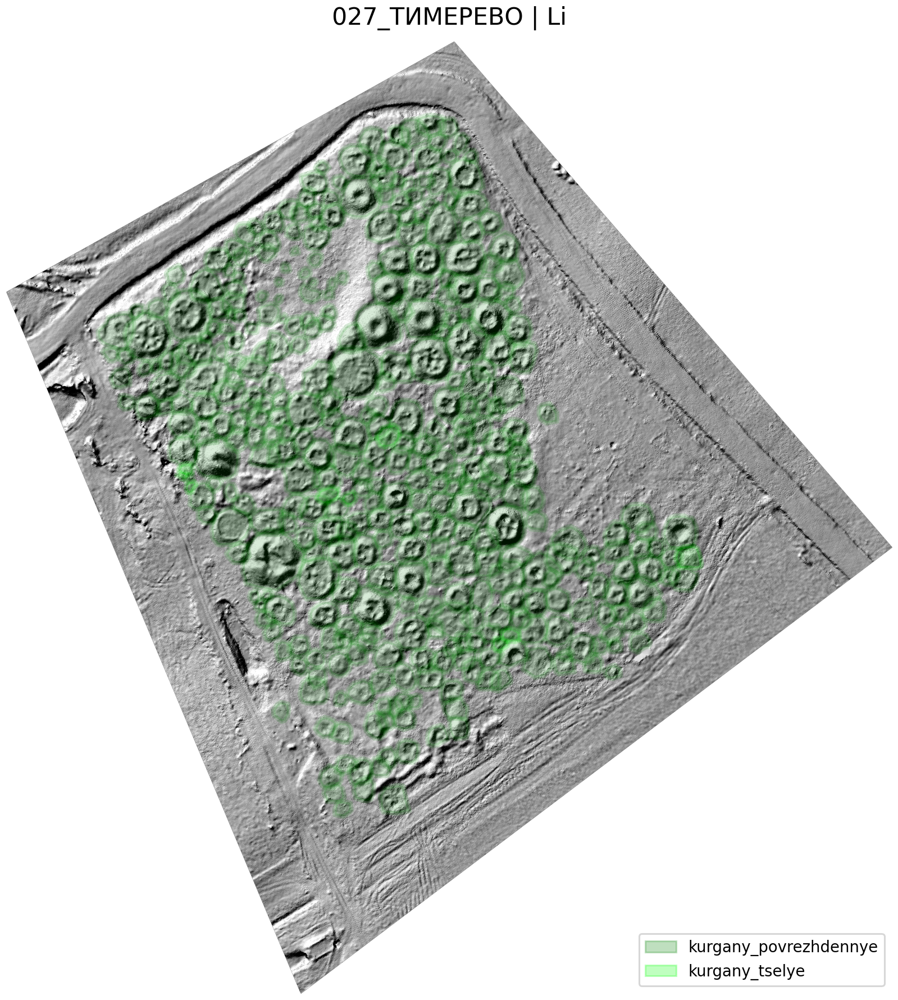

# Geodata Archaeology CV

Computer vision pipeline for archaeological object detection and segmentation from multimodal geodata.

## Что вообще происходит

Проект начался с археологических геоданных:

    LiDAR
    аэрофотосъемки
    спутниковых изображений
    .geojson разметки

Главная проблема:
    датасет изначально вообще не был CV-ready.

Нужно было:

    разбираться с CRS,
    совмещать растры и полигоны,
    строить overlay,
    генерировать patch/mask датасеты,
    собирать detection dataset.

## Overlay и проверка CRS


Одной из первых задач была проверка:
    совпадает ли геометрия объектов с растрами.

Использовались:

    rasterio
    geopandas
    shapely

```md


```md


Некоторые растры имели несовпадающий CRS, поэтому пришлось реализовать fallback reprojection.

## Генерация segmentation dataset

Следующим этапом стала генерация patch/mask датасетов.

### Early baseline

Сначала использовался простой crop вокруг объекта.

patch, mask = extract_patch_and_mask(src, polygon, padding=5)


### Adaptive crop extraction

Позже появился adaptive crop pipeline.

Идея:
размер crop зависит от размера объекта.

crop_size = max(object_size * context_scale, min_crop_size)

Это позволило:

не терять маленькие объекты,
сохранять контекст,
избежать сильного ресайза.
YOLO dataset generation

После segmentation pipeline был собран detection pipeline.

Dense bbox scene

Одна из сложностей:
огромное количество маленьких объектов на одном изображении.

Используемые инструменты
Python
rasterio
geopandas
shapely
numpy
pandas
matplotlib
PyTorch
YOLOv8
Streamlit