#  Archaeological Geodata CV Pipeline

Computer vision pipeline for converting archaeological geodata into segmentation and object detection datasets.

## Что вообще тут происходит

Проект начался с набора археологических геоданных:

    LiDAR
    аэрофотосъемка
    спутниковые изображения
    GeoJSON polygon-разметка

Главная проблема заключалась в том, что данные изначально не были пригодны для CV-задач.

Нужно было:

    совмещать raster и vector данные,
    разбираться с CRS,
    строить overlay для проверки геометрии,
    генерировать segmentation datasets,
    собирать detection datasets для YOLO.

## Overlay Validation и CRS Alignment


Одной из первых задач была проверка:
    совпадает ли геометрия объектов с растрами.

Использовались:

    rasterio
    geopandas
    shapely

<p align="center">
    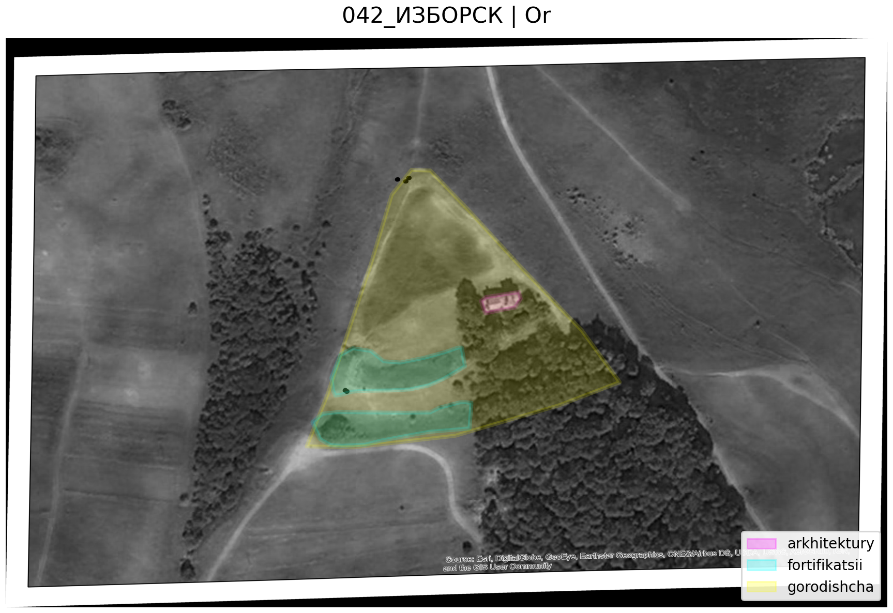
    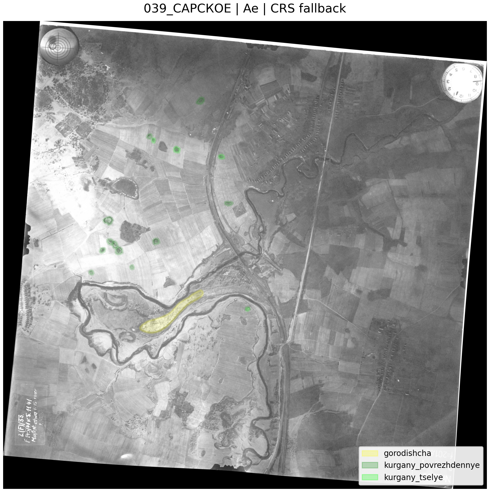
    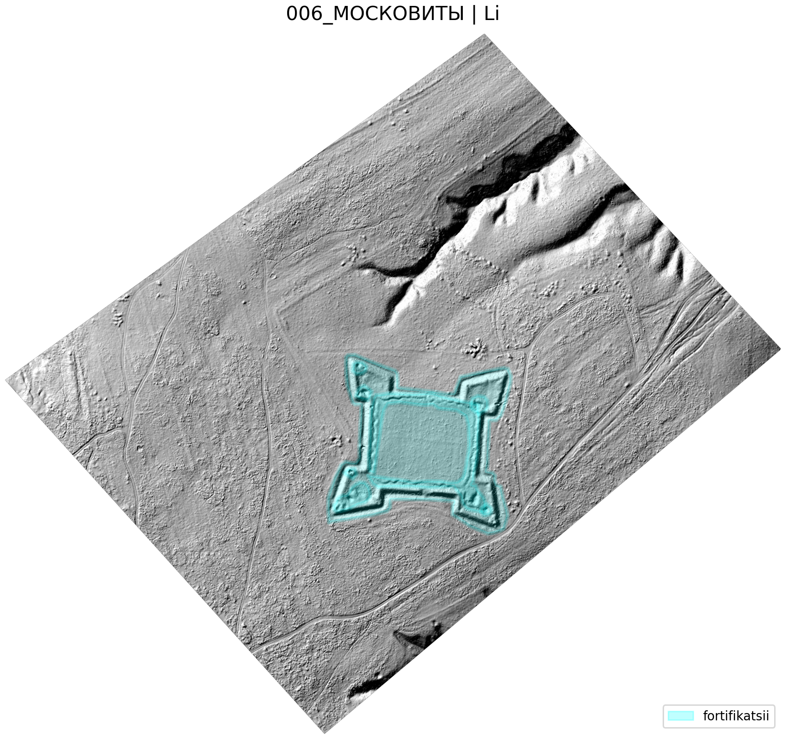
    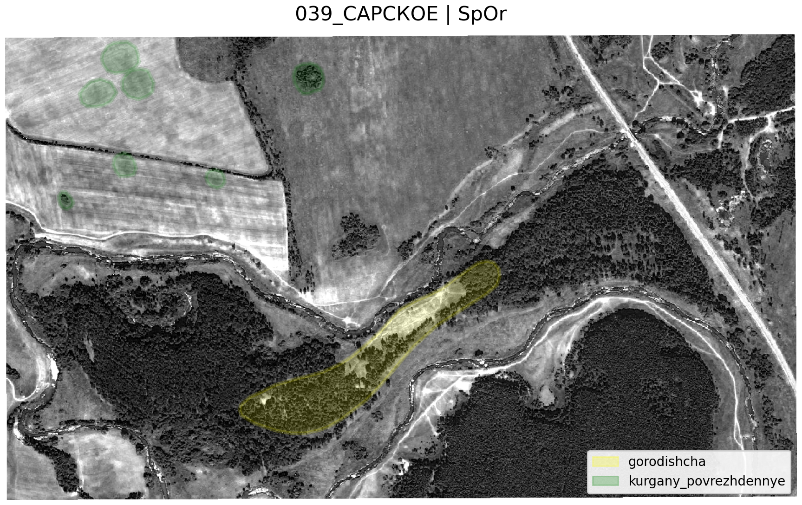
</p>

Некоторые регионы содержали несовпадающие CRS между raster и GeoJSON данными, поэтому был реализован fallback reprojection pipeline.

## Генерация segmentation dataset

Следующим этапом стала генерация patch/mask датасетов.

### Early baseline

Сначала использовался простой crop вокруг объекта с фиксированным контекстом.

<p align="center">
    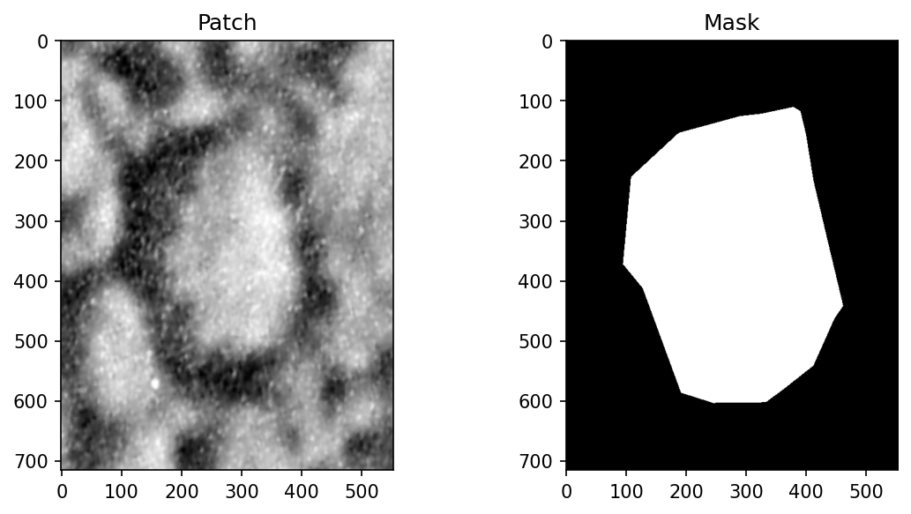
</p>

### Adaptive crop extraction

Позже появился adaptive crop pipeline.

Идея:

    размер crop автоматически адаптируется под spatial scale объекта

```python
    crop_size = max(object_size * context_scale, min_crop_size)
```
<p align="center">
    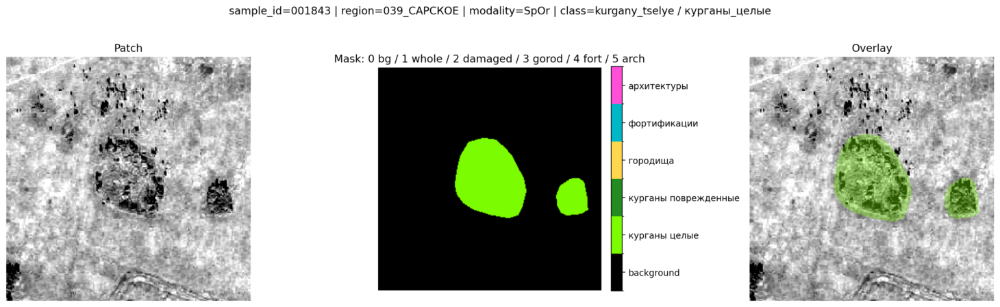
    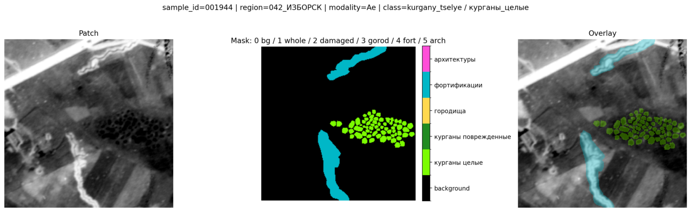
    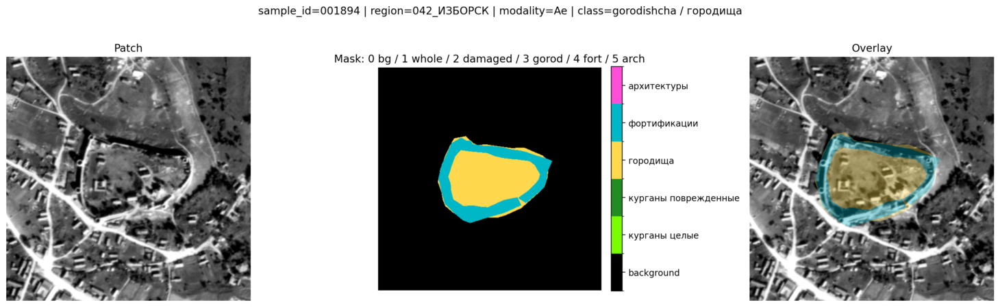
    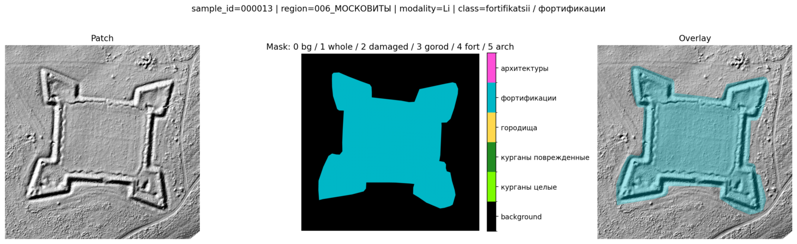
    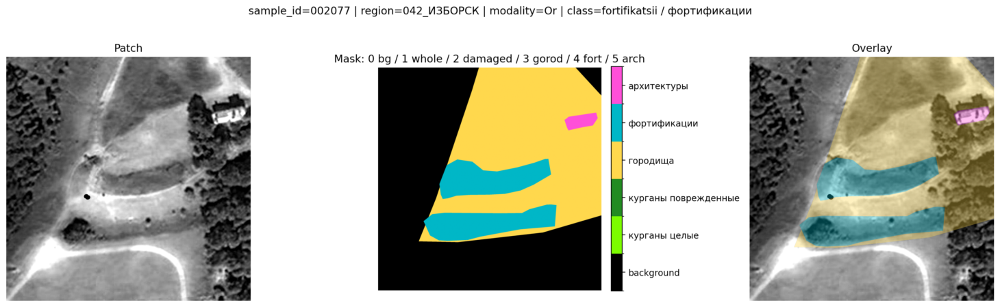
    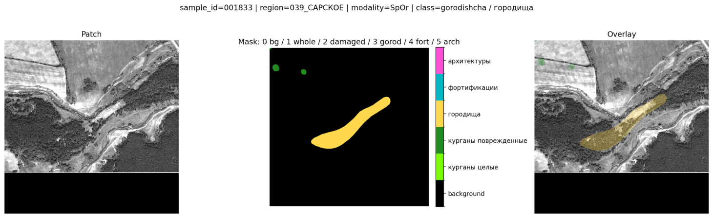
</p>

Это позволило:

- не терять маленькие объекты,
- сохранять spatial context,
- уменьшить агрессивный resize,
- лучше работать с объектами разных масштабов.

### YOLO dataset generation

После segmentation preprocessing pipeline был собран detection pipeline для YOLO.

<p align="center">
    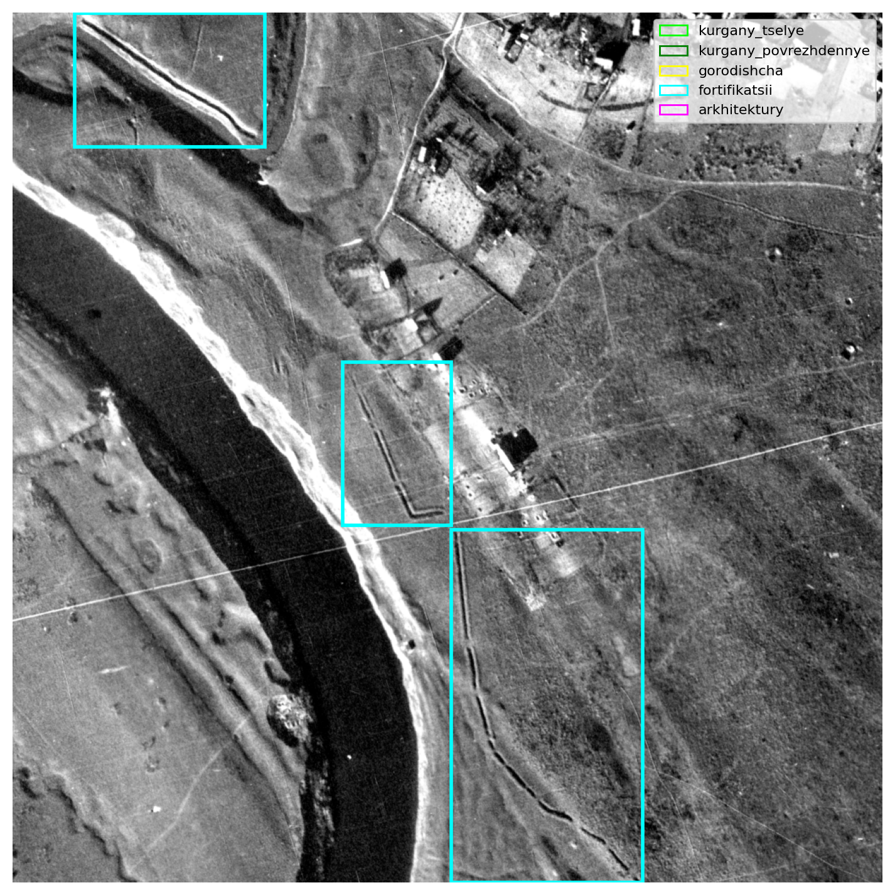
    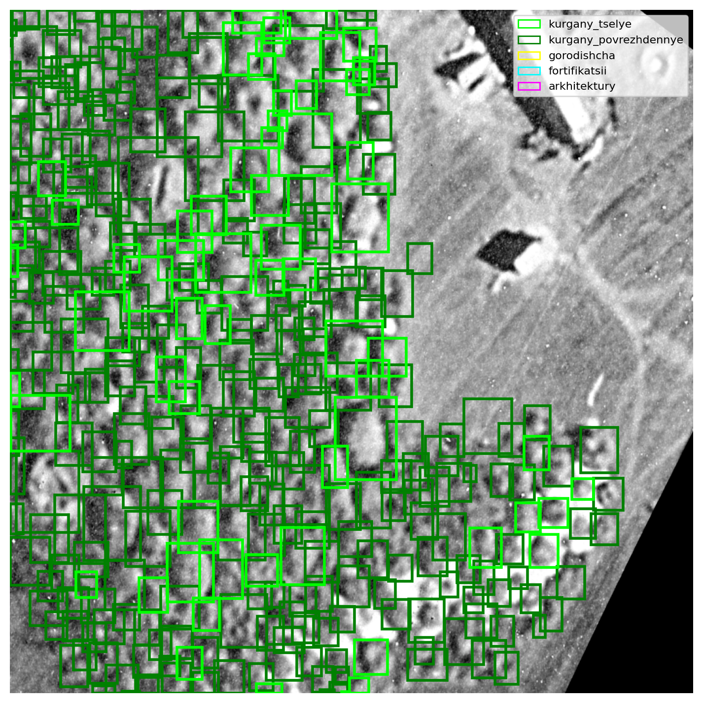
    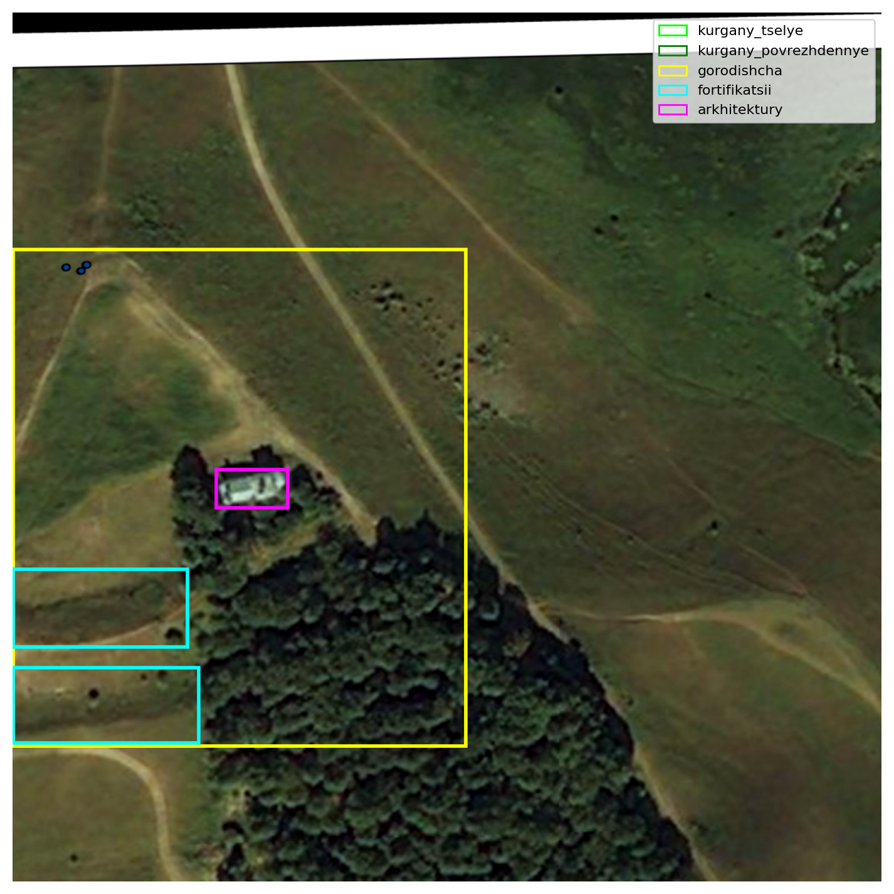
    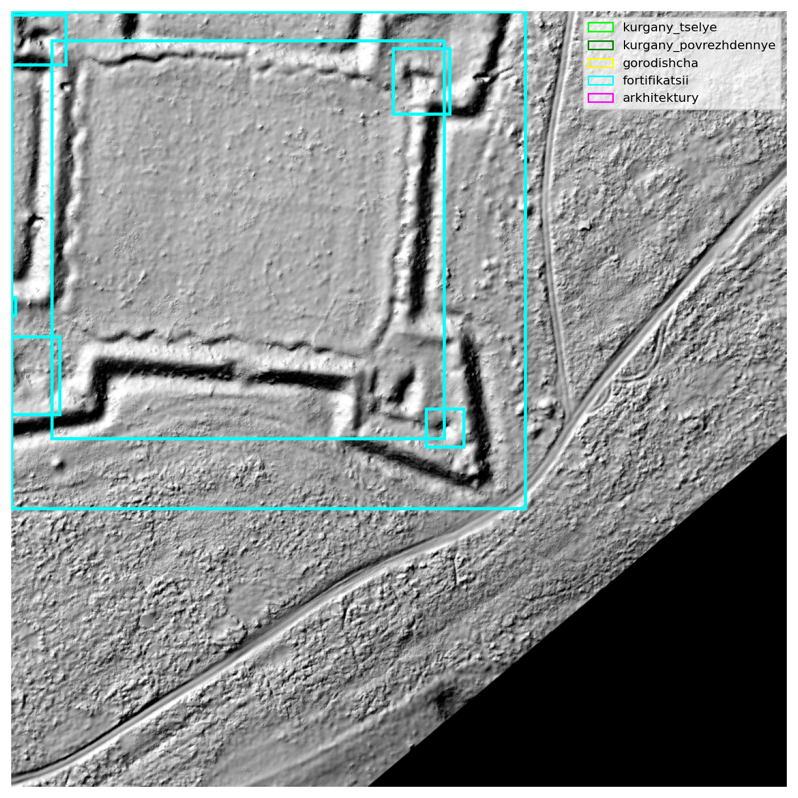
</p>

Одна из сложностей:

    oчень большое количество маленьких объектов внутри одного тайла.

## Используемые инструменты

### Geospatial
- rasterio
- geopandas
- shapely

### ML / CV
- PyTorch
- YOLOv8

### Visualization / EDA
- matplotlib
- Streamlit
