# Archaeological Geodata CV Pipeline

Computer vision pipeline for converting archaeological geodata into segmentation and object detection datasets.

## Overview

The project starts from heterogeneous archaeological geodata:

- LiDAR rasters;
- aerial imagery;
- satellite imagery;
- GeoJSON polygon annotations.

The raw data was not directly usable for computer vision. The first stage therefore focused on geospatial alignment, visual validation, and dataset generation.

Required preprocessing steps:

- align raster and vector data;
- handle CRS differences between sources;
- generate overlay visualizations for geometry checks;
- build segmentation datasets;
- build YOLO-ready detection datasets.

## Overlay Validation and CRS Alignment

The first validation step was to check whether annotated objects were correctly aligned with the raster data.

Main tools:

- `rasterio`;
- `geopandas`;
- `shapely`.

<p align="center">
    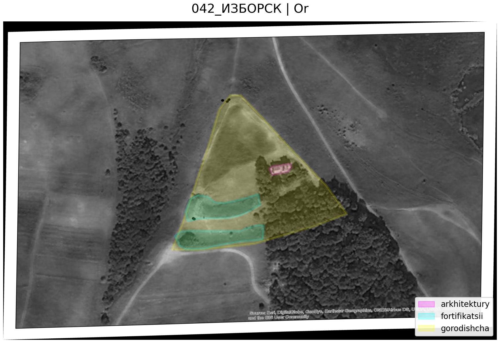
    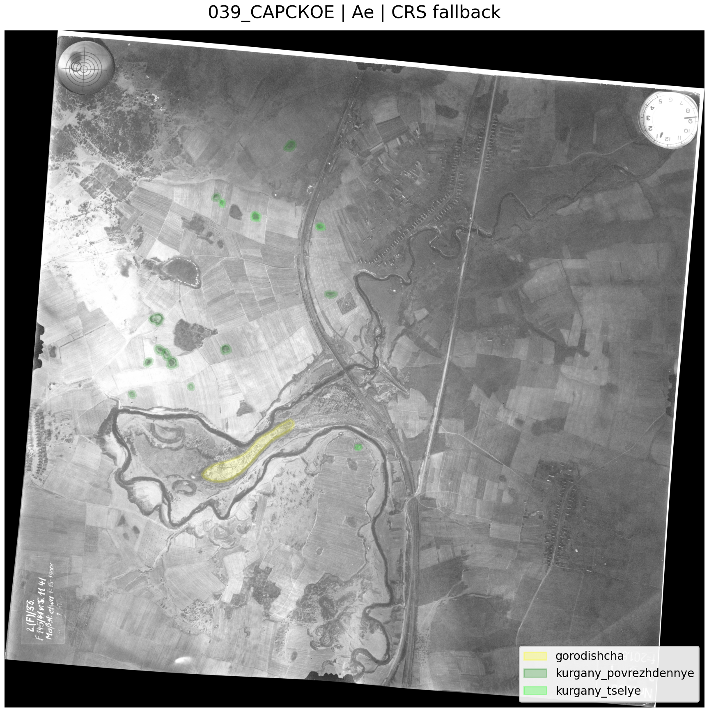
    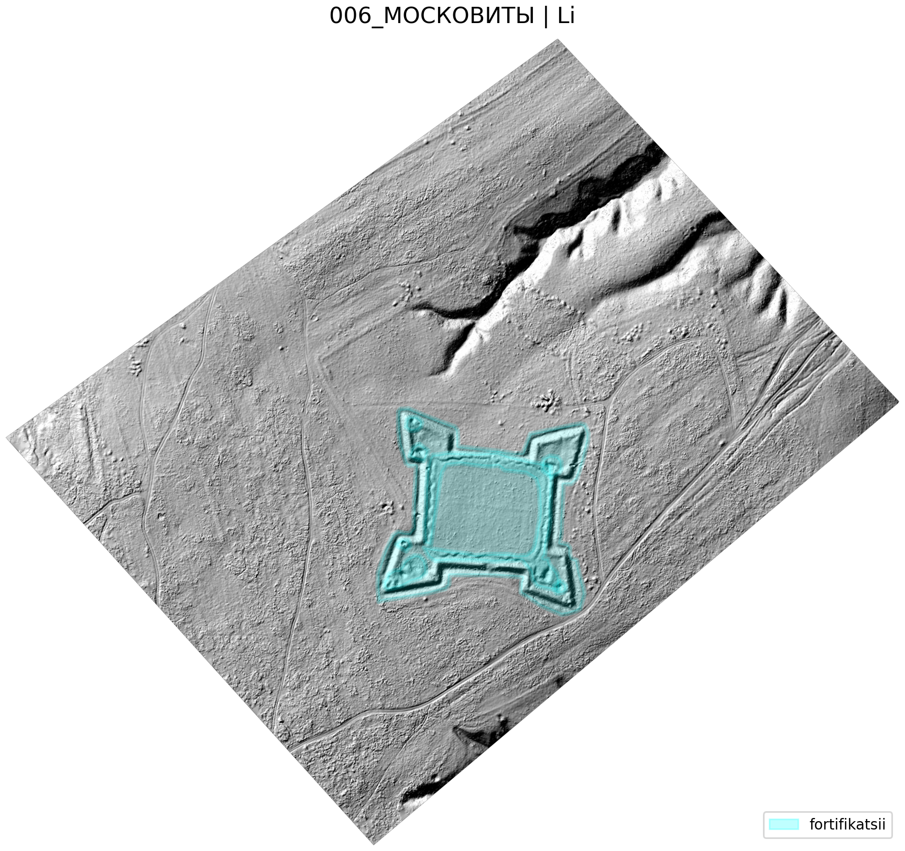
    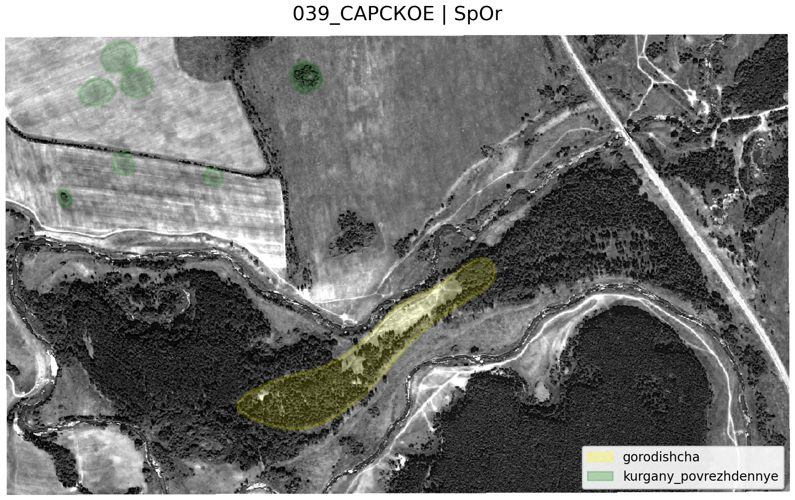
</p>

Some regions had CRS mismatches between raster and GeoJSON data, so the preprocessing pipeline includes a fallback reprojection path.

## Segmentation Dataset Generation

The next step was to generate image patches and segmentation masks.

### Early Baseline

The first baseline used a simple crop around each annotated object with a fixed context window.

<p align="center">
    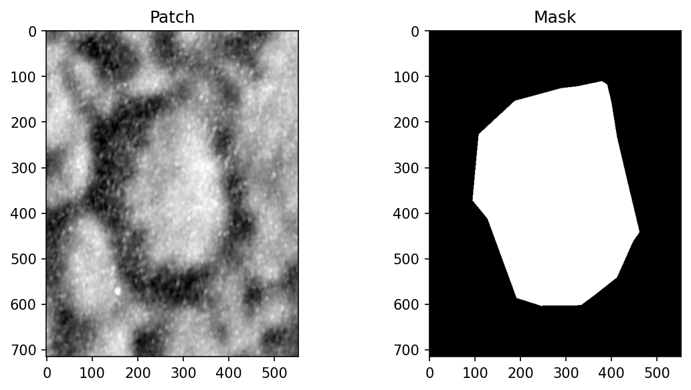
</p>

### Adaptive Crop Extraction

The later pipeline switched to adaptive crop extraction.

Crop size is adjusted to the spatial scale of each object:

```python
crop_size = max(object_size * context_scale, min_crop_size)
```

<p align="center">
    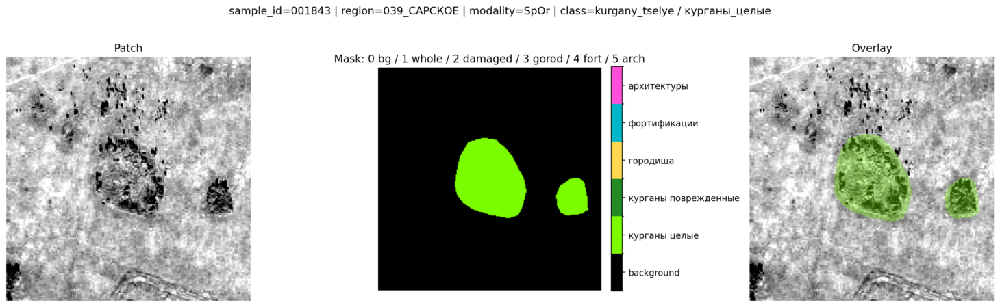
    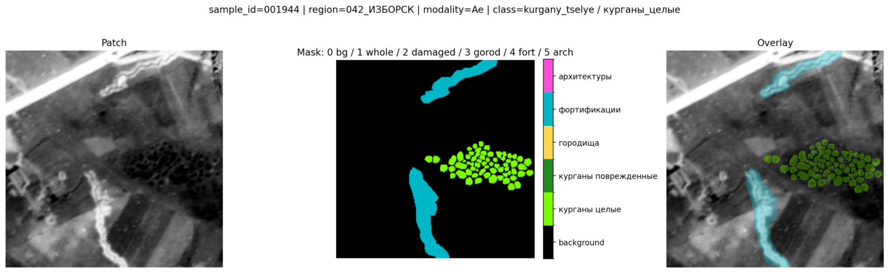
    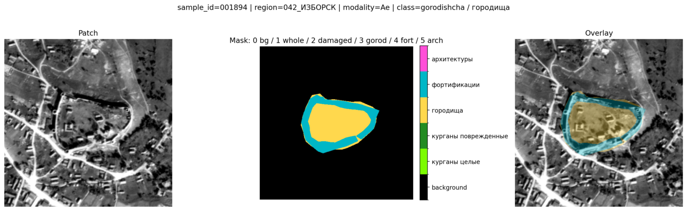
    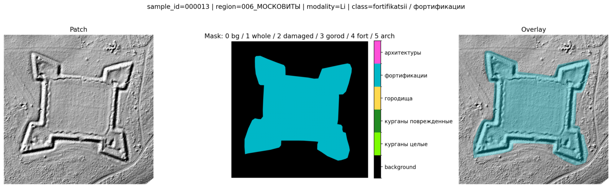
    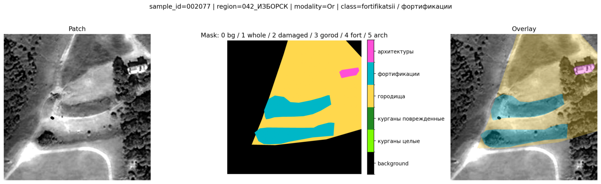
    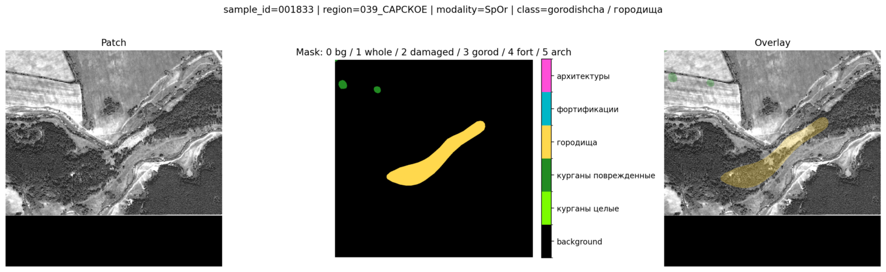
</p>

This improved dataset generation in several ways:

- small objects were less likely to be lost;
- spatial context was preserved;
- aggressive resizing was reduced;
- objects at different scales were handled more consistently.

### YOLO Dataset Generation

After the segmentation preprocessing pipeline, the same geospatial sources were used to build a YOLO detection dataset.

<p align="center">
    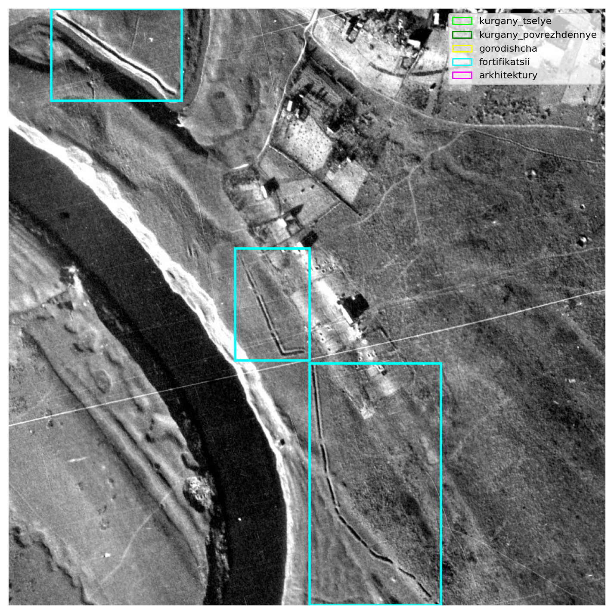
    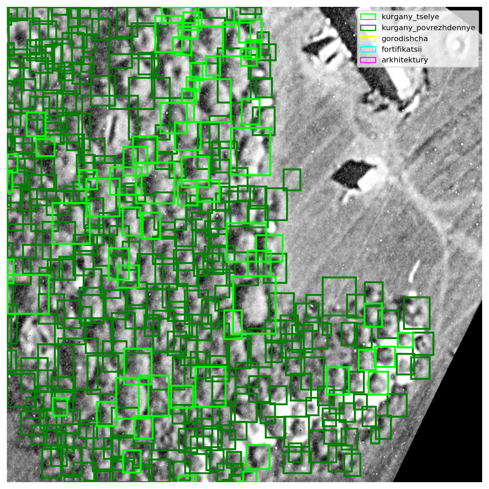
    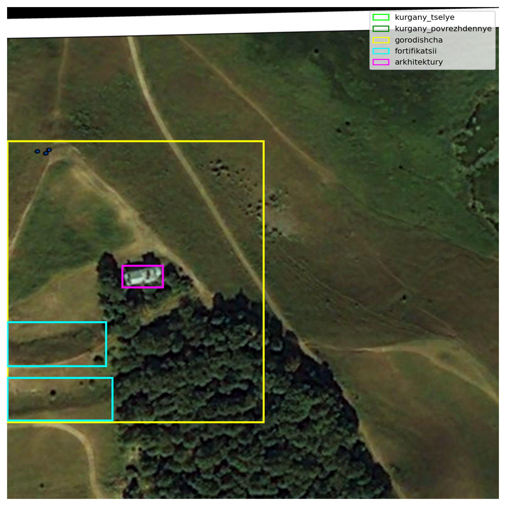
    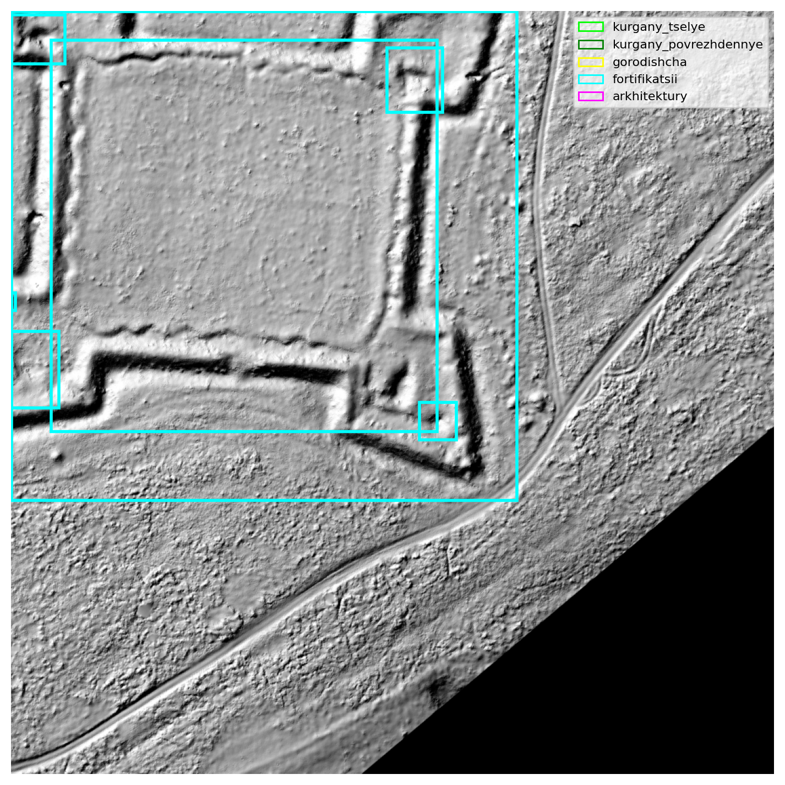
</p>

One recurring issue was the high number of small objects inside a single tile, which later became important for the detection experiments.

## Tools

### Geospatial

- `rasterio`
- `geopandas`
- `shapely`

### ML / CV

- PyTorch
- YOLOv8

### Visualization / EDA

- Matplotlib
- Streamlit
