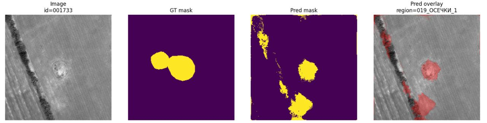

# U-Net segmentation of archaeological geospatial imagery

В данном блоке исследуется задача сегментации археологических объектов
на геопространственных данных:

- LiDAR
- aerial imagery
- orthophotos
- satellite imagery

Основной фокус:
составление baseline для задачи cегментации курганов и их типов.

## Задача

Вход:

- grayscale raster patch
- размер: 256×256

Выход:

- segmentation mask

Классы:

- 0 — background
- 1 — whole kurgans
- 2 — damaged kurgans

## Архитектура

Использована облегчённая версия U-Net:

- encoder-decoder architecture
- skip connections
- BatchNorm + ReLU
- input: 1 channel
- output: 3 classes

## Dataset pipeline

Перед обучением был реализован полный pipeline подготовки данных:

- CRS alignment
- raster/vector synchronization
- adaptive crop extraction
- mask rasterization
- metadata generation
- modality-aware dataset building

Особое внимание уделялось:

- корректной reprojection
- region-aware split
- предотвращению spatial leakage

## Validation strategy

Использовался region-aware split вместо random split.

Причина:
случайный split в геоданных приводит к утечке terrain patterns
между train и validation.

Validation выполнялась на отдельных регионах.

## Основные сложности

В ходе экспериментов были обнаружены:

    1. Class imbalance
    Whole/damaged представлены неравномерно.

    2. Blob predictions
    Модель формировала размытые probability blobs.

    3. Object merging
    Соседние объекты часто сливались.

    4. Early overfitting
    Лучшие результаты достигались на ранних эпохах обучения.

## Результаты

Лучший результат multiclass baseline:

- mean foreground IoU: ~0.48
- whole IoU: ~0.47
- damaged IoU: ~0.21

Наблюдение:

модель значительно лучше различает целые курганы,
чем повреждённые.

## Интерпретация

Полученные результаты показывают, что задача semantic separation
между whole/damaged существенно сложнее, чем простая
foreground localization.

Модель сначала учится отвечать на вопрос:

"где находится археологический объект", и только затем
"какого он типа".

## Примеры предсказаний (baseline vs final version)

    
    
    
    

