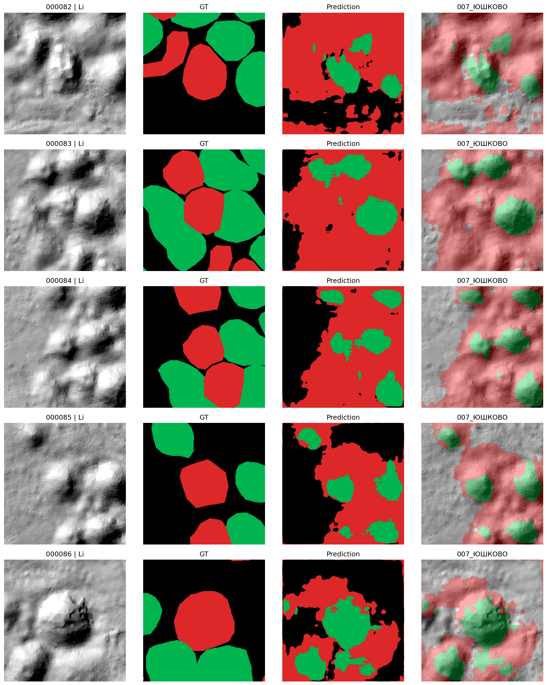
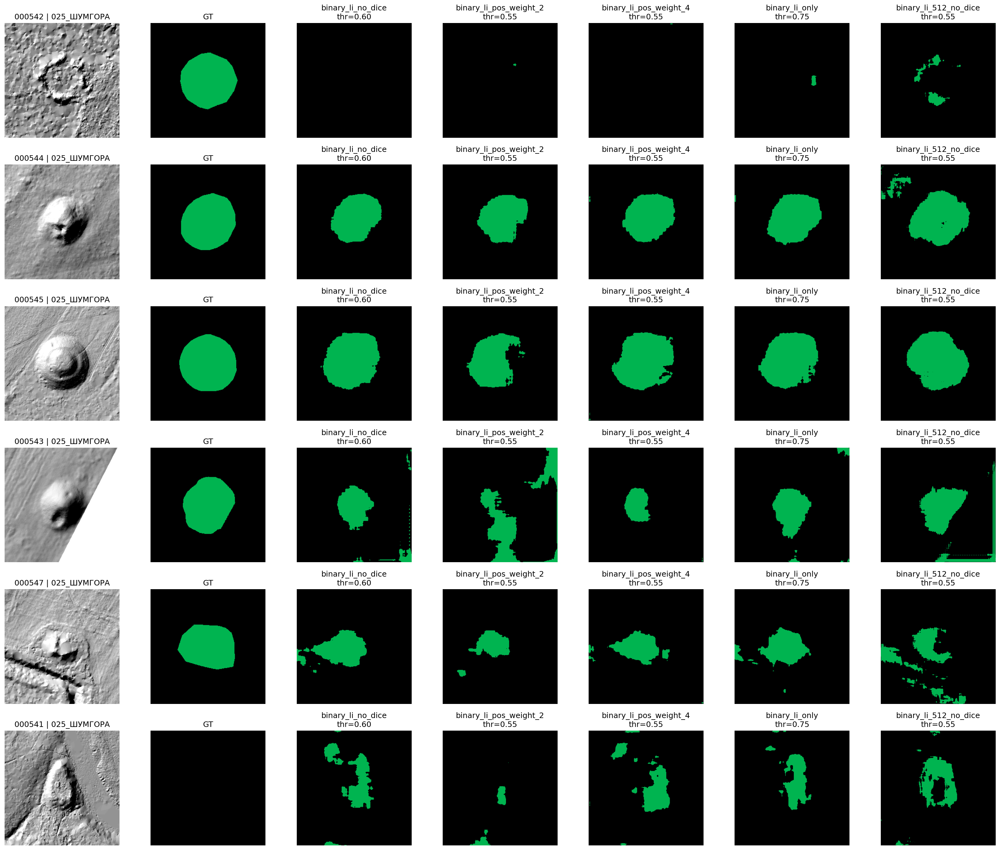

# Kurgan Segmentation with U-Net on Multi-Modal Archaeological Geodata


Экспериментальный CV-пайплайн для semantic segmentation археологических объектов на многомодальных геоданных с фокусом на курганы и LiDAR morphology.

Проект исследует, насколько разные типы геоданных подходят для автоматического выделения археологических структур:

- LiDAR;
- аэрофотоснимки (Ae);
- спутниковые изображения (SpOr);
- их комбинации.

Основная цель проекта — построить воспроизводимый segmentation baseline и исследовать:

- влияние модальности;
- multiclass vs binary formulation;
- Dice Loss;
- image size;
- threshold calibration;
- hard negatives из других археологических классов.

---


*Binary LiDAR segmentation: Image | Ground Truth | Prediction | Overlay.*

---

# STAR

## Situation

Археологическая сегментация на геоданных — сложная CV-задача:

- объекты маленькие;
- foreground сильно меньше background;
- morphology отличается между регионами;
- данные мультимодальны;
- спутниковые изображения имеют низкое spatial resolution;
- аэрофотоснимки содержат сильный domain shift;
- LiDAR хранит рельеф, но шумный и неоднородный.

Дополнительно dataset содержит разные типы археологических объектов:

- курганы;
- городища;
- фортификации;
- архитектурные структуры.

Это создаёт сложные hard negatives:
модель должна отличать курганы от других morphology-rich archaeological объектов.

---

## Task

Построить воспроизводимый segmentation pipeline:

- реализовать UNet baseline;
- поддержать multiclass и binary режимы;
- исследовать влияние:
  - модальности,
  - Dice loss,
  - class weights,
  - threshold,
  - image size;
- провести controlled experiments;
- определить лучший baseline перед переходом к DeepLabV3+.

---

## Action

### Dataset Pipeline

Используется patch-based датасет:

```text
datasets/segmentation_dataset/
├── images/
├── masks/
└── metadata.csv
```

Поддерживаемые модальности:

- `Li`
- `Ae`
- `SpOr`

---

### Multiclass Mode

| Class | Description |
|---|---|
| 0 | background |
| 1 | whole kurgan |
| 2 | damaged kurgan |

Дополнительные археологические классы автоматически маппятся в background.

---

### Binary Kurgan Mode

| Class | Description |
|---|---|
| 0 | background |
| 1 | any kurgan |

Binary mask формируется явно:

```python
mask = np.isin(mask, [1, 2])
```

где:

- `1` — whole kurgan;
- `2` — damaged kurgan.

Другие археологические классы рассматриваются как hard negatives:

- `3` — gorodishcha;
- `4` — fortifikatsii;
- `5` — arkhitektury.

Если patch содержит только `3/4/5`, GT в binary mode остаётся пустым.

---

### Реализованный Pipeline

```text
02_unet_segmentation/
├── datasets/
├── models/
├── losses/
├── scripts/
├── utils/
├── assets/readme/
├── runs/
└── notebooks/
```

Поддерживаются:

- region-aware split;
- custom validation regions;
- modality filtering;
- multiclass/binary modes;
- BCE / Dice / BCE+Dice;
- threshold sweep;
- Kaggle experiments runner;
- automatic evaluation;
- prediction visualization.

---

## Best Result

| Metric | Value |
|---|---|
| Task | Binary Kurgan Segmentation |
| Modality | LiDAR |
| Model | UNetSmall |
| Image Size | 256 |
| Loss | BCE |
| Threshold | 0.60 |
| fg_iou | **0.6789** |

# Main Results

| Experiment | Task | Modalities | Size | Loss | Best IoU |
|---|---|---|---:|---|---:|
| baseline_all_modalities | Multiclass | Li+Ae+SpOr | 256 | CE + Dice | 0.137 |
| li_only | Multiclass | Li | 256 | CE + Dice | 0.243 |
| binary_li_only | Binary | Li | 256 | BCE + Dice | 0.647 |
| binary_li_no_dice | Binary | Li | 256 | BCE | 0.665 |
| binary_li_no_dice + threshold sweep | Binary | Li | 256 | BCE | **0.679** |
| binary_li_512_no_dice | Binary | Li | 512 | BCE | 0.630 |

---


# Key Findings

- LiDAR значительно превосходит Ae и SpOr.
- Binary segmentation стабильнее multiclass formulation.
- BCE-only неожиданно оказался лучше BCE + Dice в binary mode.
- Увеличение image size с 256 до 512 ухудшило качество.
- Threshold calibration улучшила IoU с 0.665 до 0.679 без переобучения.
- Другие археологические структуры (`3/4/5`) выступают hard negatives для binary kurgan segmentation.

---

# Visual Results

## Binary LiDAR Predictions


*Good, medium and failure cases selected from validation predictions.*

---

## Multiclass LiDAR Predictions



*Multiclass segmentation частично различает whole/damaged курганы, но страдает от сильного смешения классов и foreground overprediction по сравнению с binary formulation.*

---


## Threshold Sweep


*Threshold calibration позволила улучшить IoU без переобучения модели.*

---

## Failure Cases


*Типичные ошибки: noisy terrain, merged objects, tiny kurgans, а также hard negatives — другие археологические структуры, визуально похожие на курганы.*

---

# Multiclass Experiments

## Baseline All Modalities

```text
val_mean_fg_iou = 0.137
```

Модель находила foreground, но плохо различала классы:

| Metric | Value |
|---|---|
| val_fg_iou | 0.2989 |
| whole_kurgan IoU | 0.052 |
| damaged_kurgan IoU | 0.187 |

Модель переобучалась:

- train loss падал с `1.4365 -> 0.5713`;
- val loss рос до `2.5–2.8`.

Лучший checkpoint:

- epoch 14;
- `val_mean_fg_iou = 0.137`.

---

## LiDAR оказался главным источником сигнала

| Experiment | mean_fg_iou |
|---|---|
| all modalities | 0.137 |
| Li only | **0.243** |
| Li + Ae | 0.148 |
| Ae only | 0.057 |
| SpOr only | 0.051 |

Главный вывод:

> LiDAR morphology содержит основной сигнал для archaeological mound segmentation.

---

## Почему Ae и SpOr деградировали качество

### Ae

```text
val_mean_fg_iou = 0.0567
```

Причины:

- нестабильные текстуры;
- слабый рельеф;
- курганы слишком малы;
- сильный domain shift между регионами.

---

### SpOr

```text
val_mean_fg_iou = 0.0508
```

Причины:

- низкое spatial resolution;
- morphology курганов теряется.

---

## Dice помогал в multiclass режиме

| Experiment | mean_fg_iou |
|---|---|
| CE + Dice | 0.137 |
| BCE only | 0.116 |

Dice действительно помогал small-object multiclass segmentation.

---

## Lower damaged weight улучшил баланс

| Experiment | whole_iou | damaged_iou |
|---|---:|---:|
| baseline | 0.052 | 0.187 |
| lower_damaged_weight | 0.131 | 0.133 |

Модель стала меньше перекошена в damaged class.

---

# Binary Experiments

Binary formulation резко улучшила качество.

---

## Лучший Binary Baseline

| Experiment | fg_iou |
|---|---|
| binary_li_no_dice | **0.6651** |
| binary_li_pos_weight_4 | 0.6620 |
| binary_li_pos_weight_2 | 0.6616 |
| binary_li_only | 0.6472 |

Главный вывод:

> Binary LiDAR segmentation оказалась значительно стабильнее multiclass segmentation.



---

## Dice не дает стабильного прироста

| Experiment | fg_iou |
|---|---|
| with Dice | 0.6472 |
| no Dice | **0.6651** |

Очень важный scientific insight.

Вероятные причины:

- binary task уже достаточно стабильна;
- BCE лучше оптимизирует границы;
- Dice переусредняет крупные объекты.

---

## Pos Weight почти ничего не дал

| pos_weight | fg_iou |
|---|---|
| 1 | 0.647 |
| 2 | 0.662 |
| 4 | 0.662 |

Foreground imbalance перестал быть главным bottleneck.

---

## Ae значительно ухудшает качество segmentation

| Experiment | fg_iou |
|---|---|
| binary_li_only | 0.665 |
| binary_li_ae_only | 0.396 |

Это почти напрямую показывает:

> Ae domain сильно отличается от LiDAR morphology.

---

## SpOr показал ограниченную пригодность для текущей постановки задачи.

```text
SpOr_fg_iou = 0.103
```

Практически unusable для текущей постановки.

---

# Image Size Experiments

## 512 unexpectedly underperformed

| Experiment | fg_iou |
|---|---|
| 256 no_dice | **0.6789** |
| 512 no_dice | 0.6298 |

Дополнительные эксперименты:

| Experiment | fg_iou |
|---|---|
| binary_li_512_no_dice | 0.6260 |
| binary_li_512_pos_weight_2 | 0.6153 |
| binary_li_512_ce_dice | 0.6079 |

---

## Почему 512 хуже

### 1. Patch context важнее detail

При 512:

- объект становится слишком маленьким относительно patch;
- foreground signal размывается.

### 2. UNetSmall не хватает capacity

512 требует:

- большего receptive field;
- более сильного encoder;
- richer feature hierarchy.

---

## Dice снова проигрывает

| Experiment | fg_iou |
|---|---|
| 512 no dice | 0.626 |
| 512 ce+dice | 0.608 |

Теперь это становится стабильным паттерном.

---

# Threshold Sweep

После обучения моделей был проведён threshold sweep:

```text
thresholds = 0.05 ... 0.95
```

Для каждого threshold вычислялись:

- fg_iou;
- fg_dice;
- precision;
- recall;
- pixel accuracy.

---

## Лучший результат проекта

| Model | Threshold | fg_iou |
|---|---|---|
| binary_li_no_dice | **0.60** | **0.6789** |

Threshold tuning дал почти бесплатный improvement:

```text
0.6651 -> 0.6789
```

---

## Calibration Insight

Оптимальный threshold оказался ВЫШЕ 0.5:

| Model | Best threshold |
|---|---|
| binary_li_no_dice | 0.60 |
| binary_li_pos_weight_2 | 0.55 |
| binary_li_pos_weight_4 | 0.55 |
| binary_li_only | 0.75 |

Это означает:

> модель склонна пере-предсказывать archaeological morphology, что повышает recall, но создаёт false positives на hard negatives.

---

## Precision / Recall Tradeoff

| Threshold | Precision | Recall |
|---|---|---|
| 0.50 | 0.708 | 0.909 |
| 0.60 | 0.747 | 0.882 |
| 0.75 | 0.803 | 0.797 |


Threshold > 0.5 эффективно чистит false positives.

---

# Главный Scientific Result

## Лучший pipeline проекта

```text
UNetSmall
Binary segmentation
LiDAR only
256x256
BCE only
threshold = 0.60
fg_iou = 0.6789
```

---

# Project Structure

```text
02_unet_segmentation/
├── datasets/
├── models/
├── losses/
├── scripts/
├── utils/
├── notebooks/
├── assets/readme/
├── runs/
└── archive/
```

---

# Training

## Binary LiDAR Baseline

```bash
python scripts/train.py \
  --task binary \
  --data-root "../datasets/segmentation_dataset" \
  --out-dir "runs/binary_li_no_dice" \
  --epochs 50 \
  --batch-size 8 \
  --lr 1e-3 \
  --image-size 256 \
  --split custom_regions \
  --val-regions "007_ЮШКОВО,008_СЕЛЯНЕ,025_ШУМГОРА,033_МИЛОВИДОВО_0.1км" \
  --modalities Li \
  --binary-positive-classes "1,2" \
  --dice-weight 0.0
```

---

# Threshold Sweep Usage

```bash
python scripts/threshold_sweep.py \
  --data-root "../datasets/segmentation_dataset" \
  --checkpoint "runs/binary_li_no_dice/best_model.pth" \
  --out-dir "runs/binary_li_no_dice" \
  --task binary \
  --image-size 256 \
  --split custom_regions \
  --val-regions "007_ЮШКОВО,008_СЕЛЯНЕ,025_ШУМГОРА,033_МИЛОВИДОВО_0.1км" \
  --modalities Li \
  --binary-positive-classes "1,2"
```

---

# Kaggle

Эксперименты запускались на Kaggle GPU (`Tesla T4`).

## Train

```bash
bash run_kaggle_experiments.sh
```

## Threshold Sweeps

```bash
bash run_kaggle_experiments.sh threshold_sweeps
```

---

# Repository Hygiene

В git intentionally НЕ хранятся:

- `history.csv`
- `train_split.csv`
- `val_split.csv`
- `logs/`
- `smoke_test/`
- `__pycache__/`

README использует curated visual assets из:

```text
assets/readme/
```

---

# Future Work

Следующий этап проекта:

- DeepLabV3+
- более сильные encoder’ы;
- comparison against UNet baseline;
- explicit archaeological multi-class segmentation;
- region-aware curriculum;
- candidate extraction + damage classification.

---

# Основные ML-инсайты

- LiDAR значительно превосходит Ae и SpOr;
- multiclass segmentation нестабильна на heterogeneous domains;
- binary formulation резко улучшает качество;
- Dice полезен в multiclass, но вреден в binary;
- threshold tuning даёт measurable gain;
- larger input size не всегда улучшает segmentation;
- calibration иногда важнее смены архитектуры;
- archaeological hard negatives — важная часть задачи.

---

# Ключевые технологии

- Python
- PyTorch
- NumPy
- Pandas
- Rasterio
- GeoPandas
- Matplotlib
- Kaggle
- Semantic Segmentation
- U-Net
- BCEWithLogitsLoss
- Dice Loss
- Threshold Calibration
- Archaeological LiDAR Analysis
