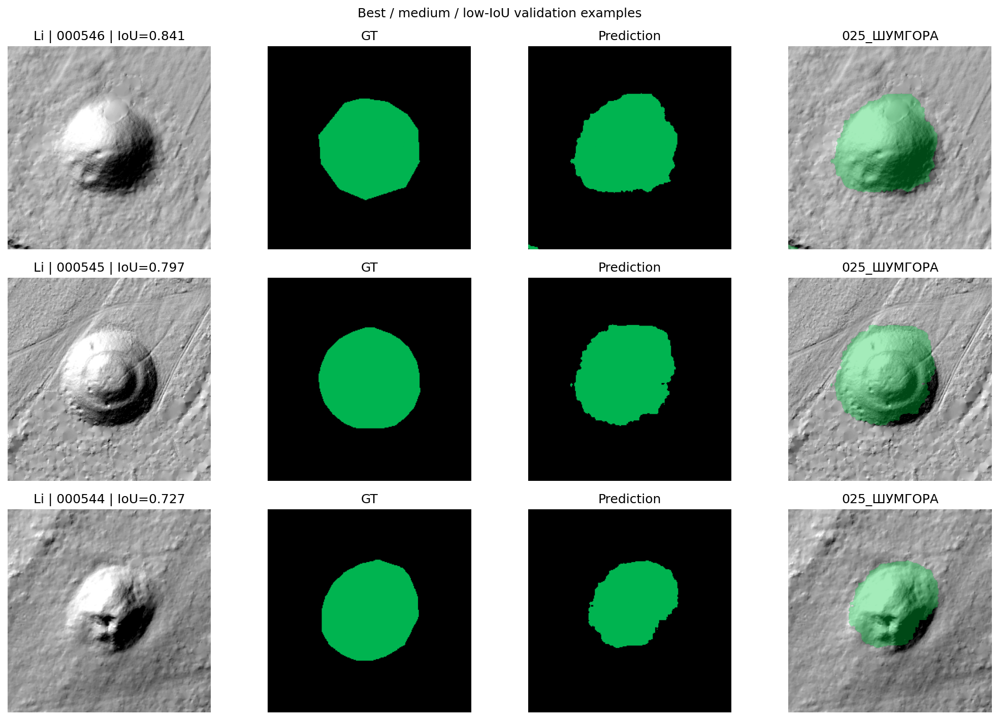
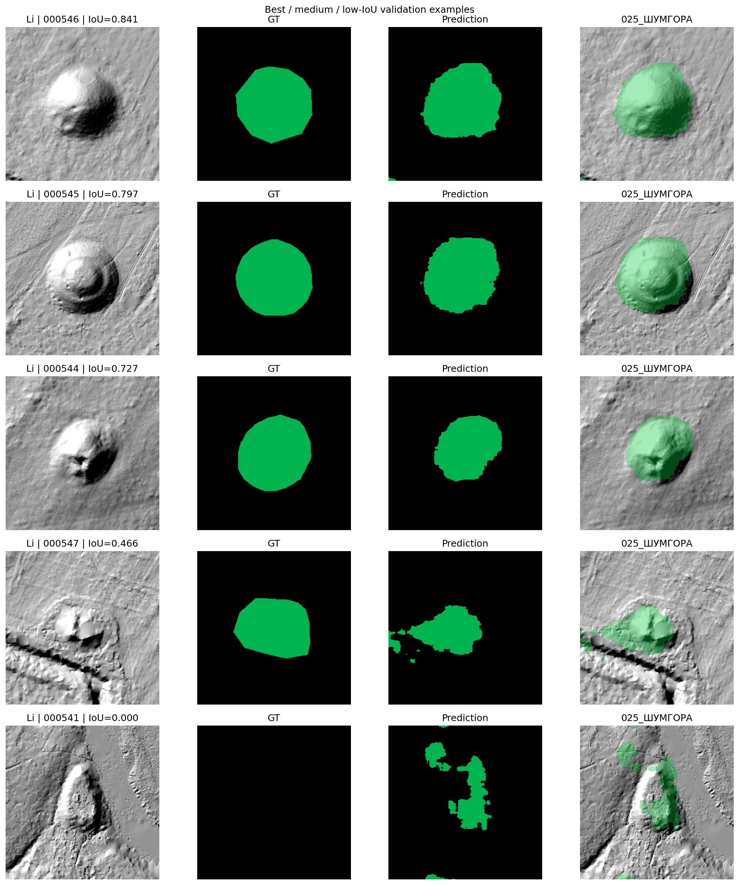
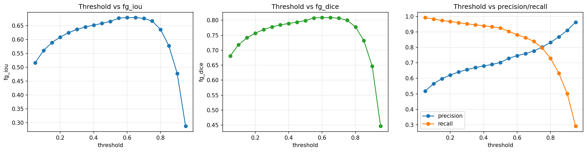
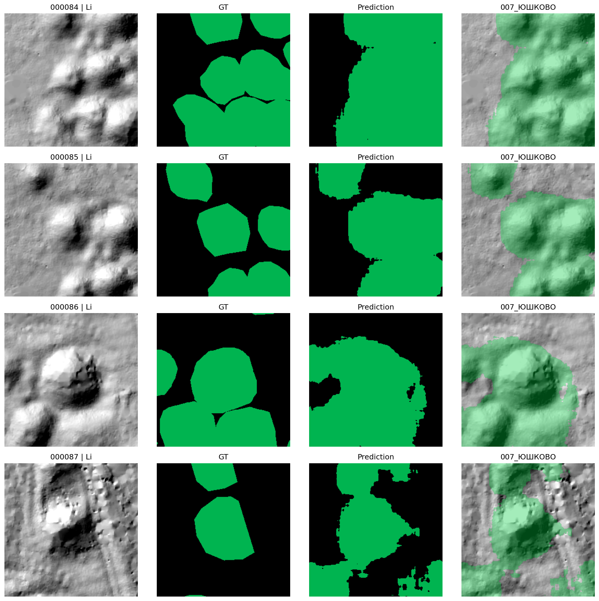

# Binary Kurgan Segmentation with U-Net

This module builds a lightweight U-Net baseline for archaeological kurgan segmentation on multimodal remote sensing data.

Its role in the full repository is deliberately focused: before moving to DeepLabV3+ and multiclass object-level segmentation, this stage tests whether a small segmentation model can learn a useful binary kurgan detector and which data modality carries the strongest signal.



*Binary LiDAR segmentation: input raster, ground truth, prediction and overlay.*

## Research Question

Can a compact U-Net establish a reliable binary segmentation baseline for kurgan detection on heterogeneous archaeological geodata?

The experiments focus on:

- modality choice: `Li`, `Ae`, `SpOr`;
- multiclass vs binary formulation;
- BCE, Dice and BCE + Dice losses;
- threshold calibration;
- image size;
- hard negatives from other archaeological classes.

## Dataset And Task

The module uses patch-based segmentation data generated by the geodata preprocessing stage:

```text
datasets/segmentation_dataset/
├── images/
├── masks/
└── metadata.csv
```

Supported modalities:

- `Li` - LiDAR-derived relief raster;
- `Ae` - aerial imagery;
- `SpOr` - satellite / orthophoto imagery.

Two formulations were tested.

| Formulation | Target classes | Purpose |
|---|---|---|
| Multiclass | `background`, `whole kurgan`, `damaged kurgan` | Check whether U-Net can separate kurgan subtypes. |
| Binary | `background`, `any kurgan` | Build a stronger practical baseline for kurgan localization. |

In binary mode, whole and damaged kurgans are merged:

```python
mask = np.isin(mask, [1, 2])
```

Other archaeological classes remain important as hard negatives:

- `gorodishcha`;
- `fortifikatsii`;
- `arkhitektury`.

If a patch contains only these non-kurgan classes, the binary ground truth is empty. This makes the baseline more realistic: the model must avoid confusing kurgans with other morphology-rich archaeological structures.

## Experimental Summary

| Experiment | Task | Modalities | Image size | Loss | Best metric |
|---|---|---|---:|---|---:|
| `baseline_all_modalities` | Multiclass | `Li`, `Ae`, `SpOr` | 256 | CE + Dice | mean fg IoU = 0.137 |
| `li_only` | Multiclass | `Li` | 256 | CE + Dice | mean fg IoU = 0.243 |
| `binary_li_only` | Binary | `Li` | 256 | BCE + Dice | fg IoU = 0.647 |
| `binary_li_no_dice` | Binary | `Li` | 256 | BCE | fg IoU = 0.665 |
| `binary_li_no_dice` + threshold sweep | Binary | `Li` | 256 | BCE | **fg IoU = 0.6789** |
| `binary_li_512_no_dice` | Binary | `Li` | 512 | BCE | fg IoU = 0.630 |

## Best Result

| Component | Value |
|---|---|
| Model | UNetSmall |
| Task | Binary kurgan segmentation |
| Modality | `Li` |
| Image size | 256 |
| Loss | BCE |
| Threshold | 0.60 |
| Validation fg IoU | **0.6789** |

Threshold calibration improved the best binary LiDAR model without retraining:

```text
fg IoU: 0.6651 -> 0.6789
```

## Key Findings

- LiDAR was the strongest individual modality for kurgan morphology.
- Binary segmentation was substantially more stable than the early multiclass U-Net formulation.
- BCE-only outperformed BCE + Dice in the best binary setup.
- Threshold calibration improved foreground IoU without changing model weights.
- Increasing image size from `256` to `512` hurt UNetSmall performance.
- Hard negatives from other archaeological classes are essential for a realistic baseline.

## Visual Results

### Binary LiDAR Predictions



*Good, medium and difficult validation examples for the best binary LiDAR model.*

### Threshold Sweep



The optimal threshold was above the default `0.5`, which suggests that the model tends to overpredict archaeological morphology at lower thresholds.

| Threshold | Precision | Recall |
|---:|---:|---:|
| 0.50 | 0.708 | 0.909 |
| 0.60 | 0.747 | 0.882 |
| 0.75 | 0.803 | 0.797 |

### Failure Cases



Typical errors include noisy terrain, merged objects, tiny kurgans and hard negatives that visually resemble burial mounds.

## What The Baseline Taught Us

### LiDAR dominates the signal

| Experiment | mean fg IoU |
|---|---:|
| All modalities | 0.137 |
| `Li` only | **0.243** |
| `Li` + `Ae` | 0.148 |
| `Ae` only | 0.057 |
| `SpOr` only | 0.051 |

LiDAR relief carries the clearest shape information for mound segmentation. Aerial and satellite modalities introduce texture and resolution issues that the small U-Net could not reliably absorb.

### Binary formulation is the stronger baseline

| Experiment | fg IoU |
|---|---:|
| `binary_li_only` | 0.6472 |
| `binary_li_pos_weight_2` | 0.6616 |
| `binary_li_pos_weight_4` | 0.6620 |
| `binary_li_no_dice` | **0.6651** |

The multiclass version partially detected foreground but struggled to separate whole and damaged kurgans. The binary formulation gave a cleaner and more useful baseline for localization.

### Larger patches did not help UNetSmall

| Experiment | fg IoU |
|---|---:|
| 256, BCE | **0.6789** |
| 512, BCE | 0.6298 |
| 512, BCE + Dice | 0.6079 |

For this architecture, larger input size likely diluted the foreground signal and required more capacity than UNetSmall could provide.

## Reproducibility

### Project Structure

```text
02_unet_segmentation/
├── datasets/
├── models/
├── losses/
├── scripts/
├── utils/
├── notebooks/
├── assets/readme/
├── runs/
└── archive/
```

### Training

```bash
python scripts/train.py \
  --task binary \
  --data-root "../datasets/segmentation_dataset" \
  --out-dir "runs/binary_li_no_dice" \
  --epochs 50 \
  --batch-size 8 \
  --lr 1e-3 \
  --image-size 256 \
  --split custom_regions \
  --val-regions "007_ЮШКОВО,008_СЕЛЯНЕ,025_ШУМГОРА,033_МИЛОВИДОВО_0.1км" \
  --modalities Li \
  --binary-positive-classes "1,2" \
  --dice-weight 0.0
```

### Threshold Sweep

```bash
python scripts/threshold_sweep.py \
  --data-root "../datasets/segmentation_dataset" \
  --checkpoint "runs/binary_li_no_dice/best_model.pth" \
  --out-dir "runs/binary_li_no_dice" \
  --task binary \
  --image-size 256 \
  --split custom_regions \
  --val-regions "007_ЮШКОВО,008_СЕЛЯНЕ,025_ШУМГОРА,033_МИЛОВИДОВО_0.1км" \
  --modalities Li \
  --binary-positive-classes "1,2"
```

Kaggle GPU experiments were launched through:

```bash
bash run_kaggle_experiments.sh
```

## Role In The Full Project

This module established the first strong segmentation baseline:

```text
Geodata preprocessing
    -> Binary U-Net kurgan segmentation
    -> Multiclass DeepLabV3+ object-level segmentation
```

The main conclusion carried forward into the DeepLabV3+ research module was that LiDAR geometry is highly informative, but realistic archaeological segmentation requires stronger validation, object-level metrics and explicit handling of multiclass ambiguity.
