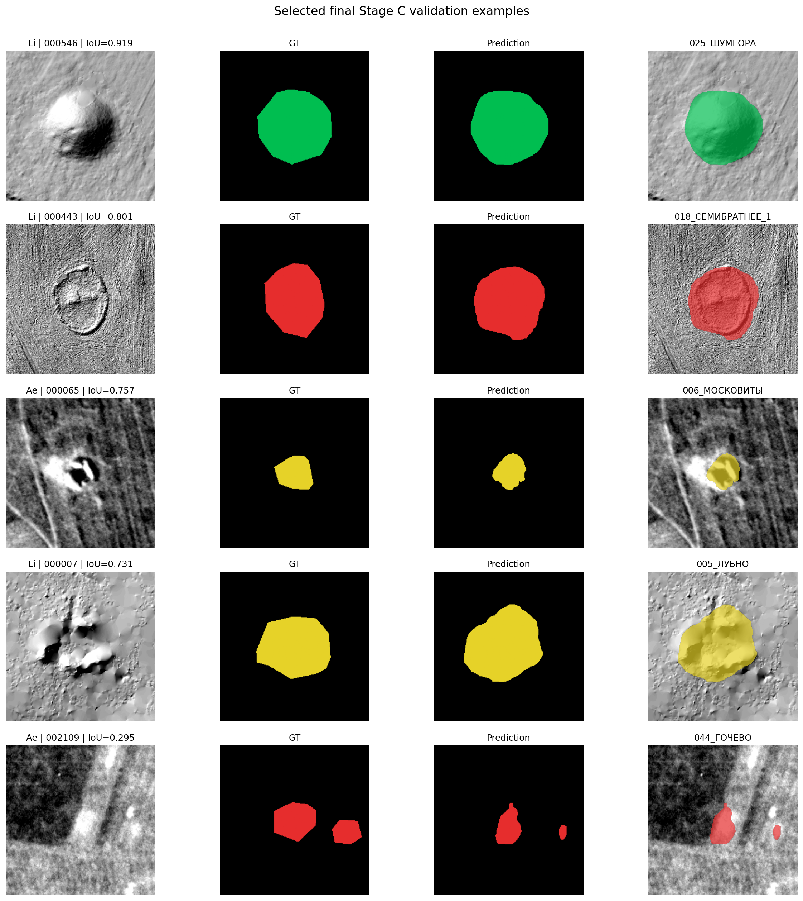
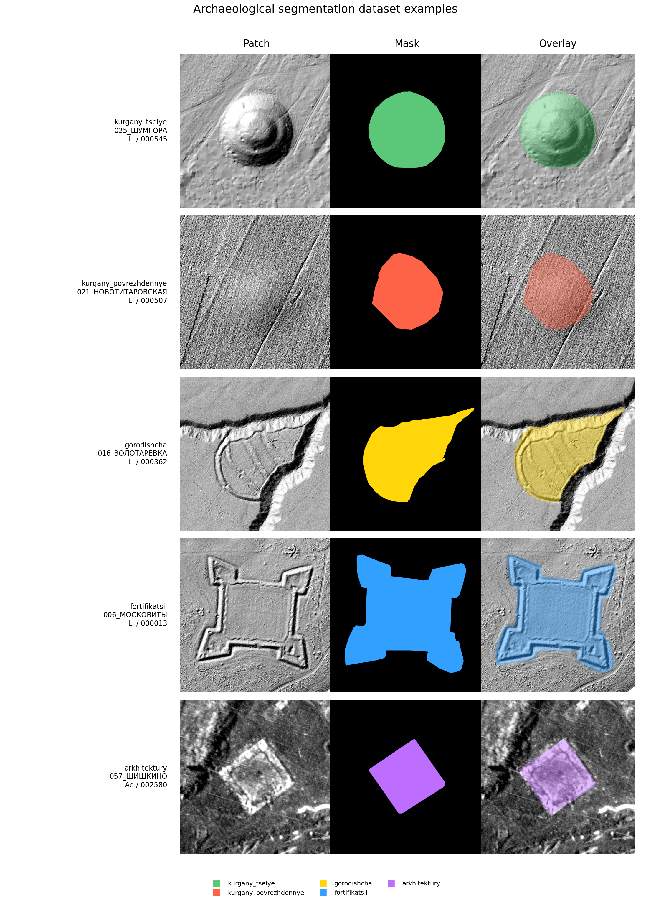
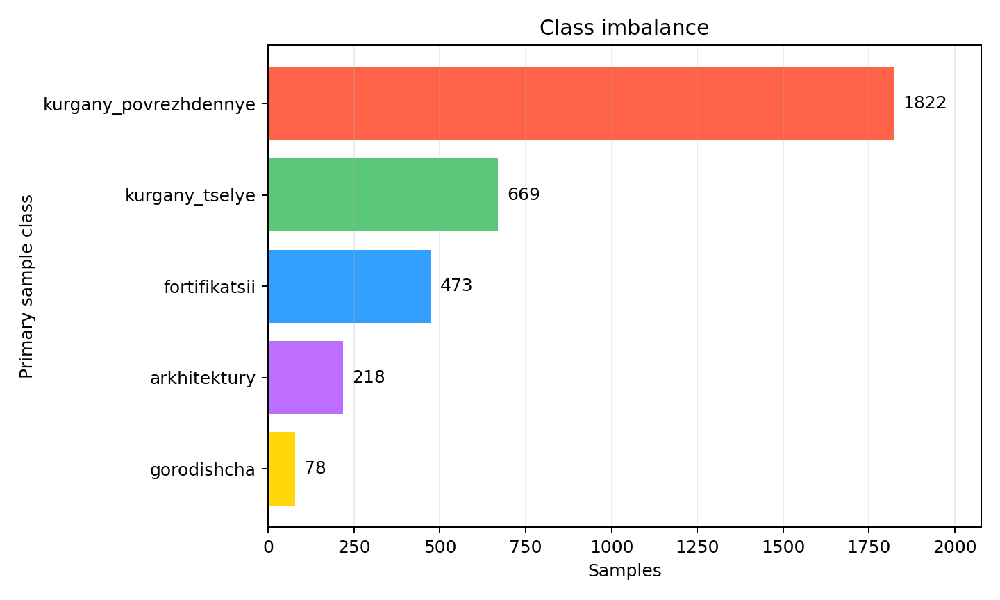
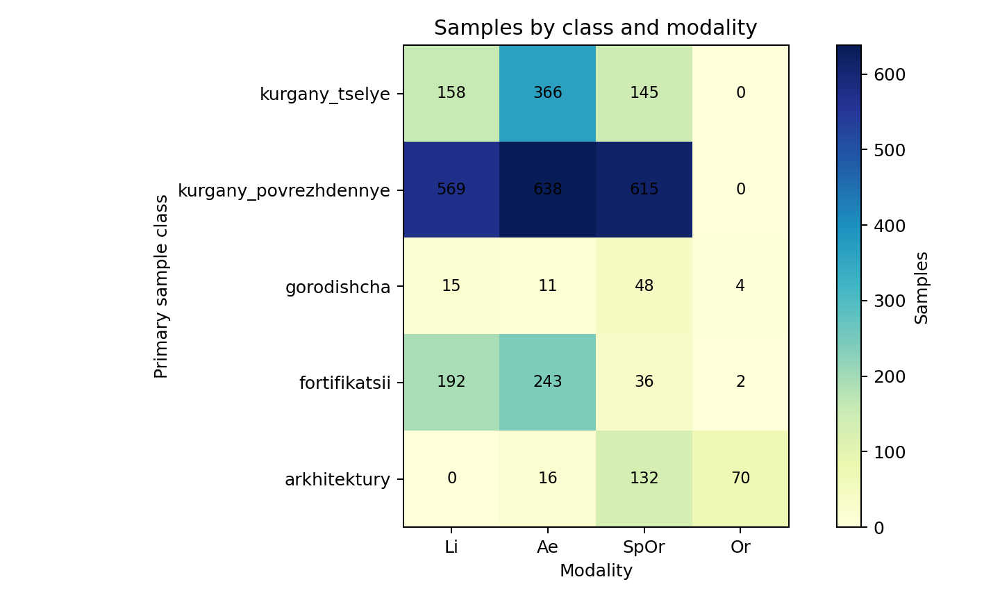
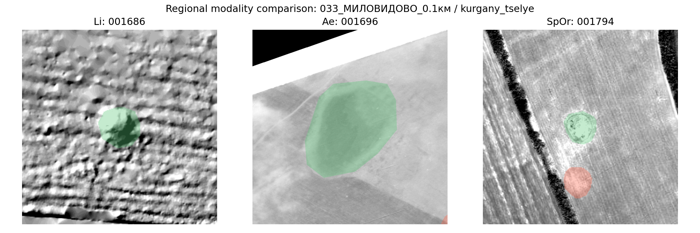
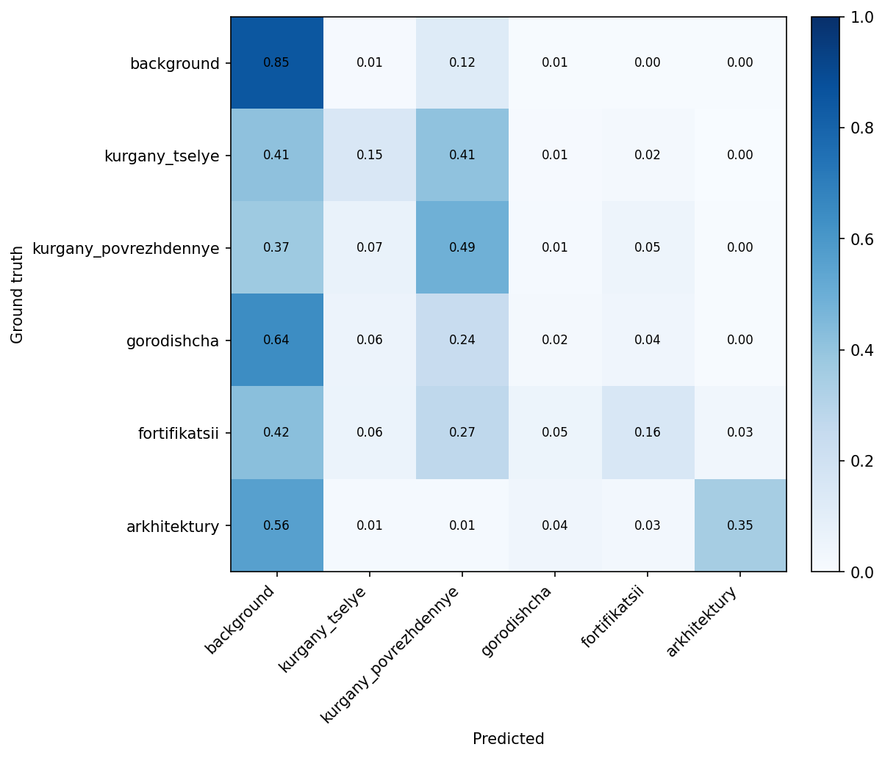
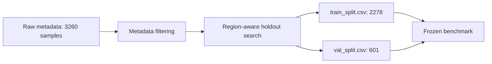
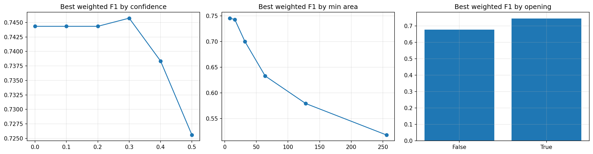
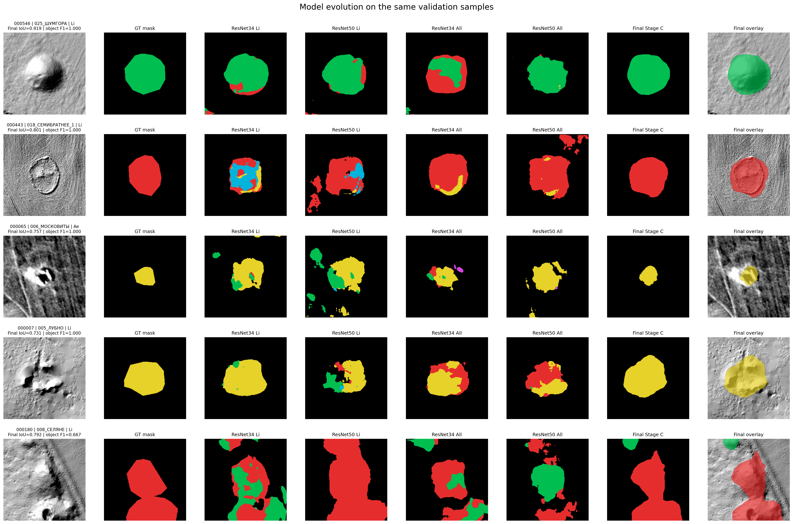
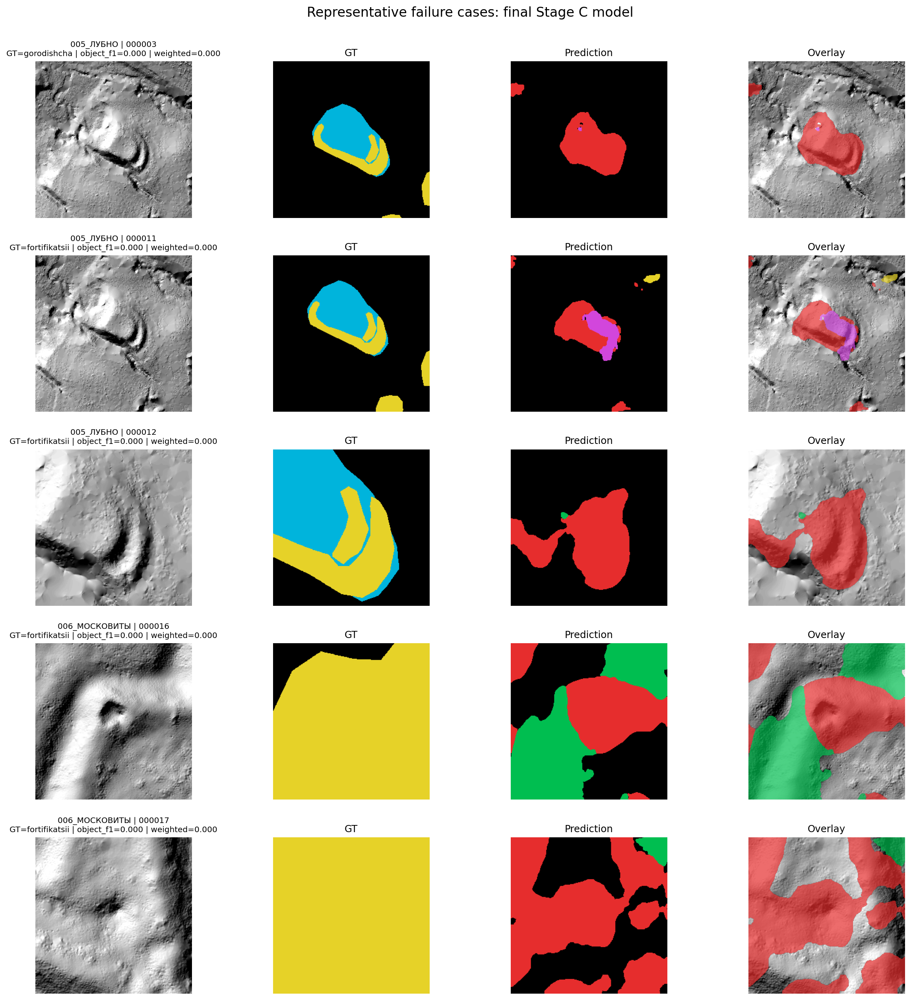

# Segmentation with DeepLabV3+ on Multi-Modal Archaeological Geodata

## Project Overview

This module studies multiclass semantic segmentation of archaeological objects in remote-sensing data.

The project is structured as a reproducible ML research workflow. Each stage addresses a specific question:

- which modalities are most informative;
- whether ResNet34 is sufficient;
- how to define a fair benchmark protocol;
- how much the result depends on random seed;
- whether object extraction can be improved without retraining the neural network.



The final pipeline uses DeepLabV3+ with a ResNet34 encoder, `Li`, `Ae`, and `SpOr` modalities, and Stage C postprocessing. Model selection and final metrics are reported separately to keep architecture choice and object-level evaluation distinct.

## Problem Statement

The task is to segment five archaeological foreground classes on raster patches and convert predicted masks into object polygons suitable for downstream geospatial analysis.

| ID | Class |
|---:|---|
| 0 | `background` |
| 1 | `kurgany_tselye` |
| 2 | `kurgany_povrezhdennye` |
| 3 | `gorodishcha` |
| 4 | `fortifikatsii` |
| 5 | `arkhitektury` |

This is an object-level task. Pixel IoU is useful for boundary diagnostics, but it does not fully capture practical quality: a coarse but correctly localized polygon can be more useful than a visually neat mask fragment.

Model selection therefore uses weighted polygon-level competition F1.

| Metric group | Purpose |
|---|---|
| Pixel IoU, Dice, pixel accuracy | segmentation diagnostics and error analysis |
| Object precision, recall, F1 | connected-component detection quality |
| Weighted competition F1 | primary validation metric for pipeline selection |

Object-level class weights:

| Class | Weight |
|---|---:|
| `kurgany_povrezhdennye` | 27.8 |
| `kurgany_tselye` | 22.2 |
| `gorodishcha` | 16.7 |
| `arkhitektury` | 11.1 |
| `fortifikatsii` | 5.6 |

## Stage 1. Dataset Profiling

### Research Question

What data is available, how balanced is it, and which modalities contain the clearest archaeological morphology?

### Data Structure

Each patch is stored as a single-channel `.npy` array. Metadata contains region, modality, source file, crop geometry, and class statistics. The source dataset is not published in GitHub.

```text
segmentation_dataset/
├── metadata.csv
├── images/
│   └── 000001.npy
└── masks/
    └── 000001.npy
```

| Property | Value |
|---|---:|
| Samples | 3260 |
| Regions | 109 |
| Modalities | 4 |
| Foreground classes | 5 |

### Object Examples



### Class Imbalance



Damaged burial mounds dominate the patch dataset. `gorodishcha` and `arkhitektury` are much rarer, so validation design and error analysis are especially important for these classes.

### Modality Distribution

| Modality | Description | Samples |
|---|---|---:|
| `Ae` | aerial imagery | 1274 |
| `SpOr` | satellite / orthophoto imagery | 976 |
| `Li` | LiDAR-derived raster | 934 |
| `Or` | additional orthophoto imagery | 76 |



Classes are not evenly distributed across sources. For example, the raw metadata contains no `Li` samples for `arkhitektury`. The rare `Or` modality is retained in the dataset profile, but the final multimodal pipeline uses the three main modalities: `Li`, `Ae`, and `SpOr`.

### Li, Ae, and SpOr Comparison



The collage shows one region and one main class represented in `Li`, `Ae`, and `SpOr`. These are regional examples, not guaranteed pixel-aligned crops.

### Stage Result

LiDAR contains the clearest geometry for archaeological objects. Multimodal data is still retained because class coverage is uneven across sources and visual modalities can complement LiDAR.

## Stage 2. Encoder and Modality Comparison

### Hypothesis

A deeper ResNet50 encoder may improve segmentation quality, but the effect has to be tested separately for LiDAR-only and multimodal inputs.

### Experiment

Four diagnostic DeepLabV3+ models were trained on raw metadata without additional filtering. All runs used image size `256`, batch size `8`, learning rate `1e-3`, CE + Dice loss, and the same region allocation between train and validation.

| Experiment | Encoder | Modalities | Best epoch | Mean fg IoU | Pixel accuracy | Object F1 | Weighted competition F1 |
|---|---|---|---:|---:|---:|---:|---:|
| `resnet34_li` | ResNet34 | `Li` | 23 | 0.1510 | 0.5770 | 0.4195 | 0.3421 |
| `resnet50_li` | ResNet50 | `Li` | 40 | **0.1589** | 0.5943 | 0.6058 | 0.4832 |
| `resnet34_all` | ResNet34 | all | 45 | **0.1253** | 0.7300 | **0.7790** | **0.6603** |
| `resnet50_all` | ResNet50 | all | 50 | 0.1028 | **0.7425** | 0.7306 | 0.6299 |

### Interpretation

On LiDAR-only data, ResNet50 gave a small mean foreground IoU gain. On all modalities, that advantage disappeared: ResNet34 achieved better mean foreground IoU, object F1, and weighted competition F1. Increasing encoder depth did not provide a stable improvement.

The Li-only validation subset contains no `arkhitektury` objects, so this experiment is diagnostic rather than a final benchmark. Its role is to guide the next research stage.



The confusion matrix belongs to an early diagnostic split. It is useful for understanding model behavior, but it is not the final Stage C result.

### Stage Result

ResNet34 was selected as the main encoder because it behaved more consistently on multimodal data and kept the rest of the study compact.

## Stage 3. Research Split

### Motivation

The diagnostic experiments helped choose the encoder, but a fixed validation protocol was needed for reliable model comparison.

The Research Split was prepared once and saved as CSV files. Raw metadata is filtered first, then a region-aware validation holdout is selected. Training does not rerun split search; all benchmark models use the frozen CSV files.



### Protocol Rules

- train and validation are separated by region;
- regions do not overlap between split parts;
- CSV files are fixed and reused;
- validation-region search is not rerun during model comparison;
- model selection and postprocessing are performed only on validation.

### Configuration

| Parameter | Value |
|---|---|
| Protocol | `archaeology_5class_research_split_v1` |
| Group column | `region` |
| Stratification | `class_name`, `modality` |
| Validation fraction | `0.2` |
| Minimum validation samples per class | `5` |
| Candidate trials | `5000` |
| Random state | `42` |
| Train samples | `2278` |
| Validation samples | `601` |
| Train regions | `74` |
| Validation regions | `30` |

```text
splits/archaeology_5class_research_split_v1/
├── train_split.csv
├── val_split.csv
├── split_config.json
└── split_stats.md
```

### Stage Result

The Research Split created a reproducible no-region-leakage benchmark. All following benchmark runs are compared only inside this protocol.

## Stage 4. Seed Study

### Hypothesis

A single good run may be caused by random initialization. Before choosing the final model, seed variance has to be measured.

### Experiment

The model family was kept narrow: DeepLabV3+ with ResNet34. Two groups of models were trained on the frozen Research Split with seeds `13`, `21`, `42`, `77`, and `101`:

- `Li` only;
- multimodal `Li`, `Ae`, `SpOr`.

In total, `10` comparable benchmark runs were trained. The values below are reported before postprocessing.

### Li Results

| Seed | Best epoch | Weighted competition F1 | Object F1 | Precision | Recall | Mean fg IoU |
|---:|---:|---:|---:|---:|---:|---:|
| 13 | 33 | 0.6902 | 0.7522 | 0.7427 | 0.7620 | 0.1225 |
| 21 | 42 | 0.7151 | 0.7783 | 0.8333 | 0.7300 | 0.1276 |
| 42 | 19 | 0.6341 | 0.6176 | 0.6409 | 0.5960 | 0.1153 |
| 77 | 28 | 0.6727 | 0.7886 | 0.7527 | **0.8280** | **0.1393** |
| 101 | 43 | **0.7310** | **0.8276** | **0.8395** | 0.8160 | 0.1391 |

### Li, Ae, and SpOr Results

| Seed | Best epoch | Weighted competition F1 | Object F1 | Precision | Recall | Mean fg IoU |
|---:|---:|---:|---:|---:|---:|---:|
| 13 | 19 | 0.6620 | 0.6484 | **0.9609** | 0.4893 | 0.0862 |
| 21 | 24 | **0.6811** | 0.6802 | 0.9456 | 0.5312 | **0.0938** |
| 42 | 8 | 0.6778 | 0.6104 | 0.9252 | 0.4555 | 0.0813 |
| 77 | 36 | 0.6725 | 0.7072 | 0.9490 | 0.5635 | 0.0871 |
| 101 | 28 | 0.6700 | **0.7480** | 0.9540 | **0.6152** | 0.0859 |

### Interpretation

Both model groups showed noticeable variance. The best seed also depended on the metric: among multimodal models, seed `21` led by weighted competition F1, while seed `101` led by object F1 and recall.

### Stage Result

The result depends substantially on random initialization. Selecting the final model from a single training run would be unreliable.

## Research Summary Table

The table shows how the best weighted competition F1 changed across the study.

| Stage | Best result |
|---|---:|
| Encoder comparison | 0.6603 |
| Research Split | 0.7310 |
| Postprocessing sweep | **0.7457** |

The full `18`-row table with diagnostic models, benchmark runs, and postprocessing variants is stored in [`reports/research_summary.md`](reports/research_summary.md).

## Stage 5. Checkpoint Selection

### Selection Goal

After the seed study, a small set of promising checkpoints was selected for object extraction tuning without retraining the network.

| Modalities | Checkpoint | Weighted competition F1 | Reason included |
|---|---|---:|---|
| `Li` | `resnet34_li_seed_101` | **0.7310** | best Li-only checkpoint |
| `Li`, `Ae`, `SpOr` | `resnet34_all_seed_21` | **0.6811** | best multimodal weighted competition F1 |
| `Li`, `Ae`, `SpOr` | `resnet34_all_seed_77` | 0.6725 | higher object recall |
| `Li`, `Ae`, `SpOr` | `resnet34_all_seed_101` | 0.6700 | best multimodal object F1 and recall |

### Stage Result

The checkpoint with the best weighted competition F1 before postprocessing does not necessarily produce the best final object-level pipeline. Mask-to-polygon conversion has to be tuned separately.

## Stage 6. Postprocessing Sweep

### Motivation

The network outputs per-pixel class probabilities. For practical use, these probabilities have to be converted into clean connected objects.

The postprocessing sweep tests how much object-level quality can be improved without retraining the model.

### Parameters

**Confidence threshold** — minimum model confidence for a pixel to be treated as part of an object. Lower values may improve recall but can add false positives.

**Minimum component area** — removes small connected components that are unlikely to be archaeological objects.

**Morphological opening** — erosion followed by dilation. This removes isolated pixels, small protrusions, and noisy links between objects.

### Search Space

| Parameter | Values |
|---|---|
| Confidence threshold | `0.0`, `0.1`, `0.2`, `0.3`, `0.4`, `0.5` |
| Minimum component area | `8`, `16`, `32`, `64`, `128`, `256` |
| Morphological opening | `False`, `True` |
| Combinations per checkpoint | `72` |
| Validation configurations for four checkpoints | `288` |

All decisions were made on validation only. No test split was used for model selection.

### Results

| Checkpoint | Weighted competition F1 | Best weighted competition F1 | Delta | Confidence | Min area | Opening |
|---|---:|---:|---:|---:|---:|---|
| `resnet34_li_seed_101` | 0.7310 | 0.7316 | +0.0006 | 0.3 | 8 | False |
| `resnet34_all_seed_21` | 0.6811 | 0.7246 | +0.0435 | 0.3 | 8 | True |
| `resnet34_all_seed_77` | 0.6725 | 0.6949 | +0.0224 | 0.3 | 8 | True |
| `resnet34_all_seed_101` | 0.6700 | **0.7457** | **+0.0757** | 0.3 | 8 | True |



### Stage Result

Postprocessing changed the final model choice. The best checkpoint before postprocessing was Li-only, but the strongest object-aware pipeline used multimodal ResNet34 with seed `101`.

## Model Evolution on the Same Validation Samples

The figure below applies successive pipeline versions to the same validation patches: early diagnostic encoder/modality models and the final all-modality ResNet34 model.

Each patch keeps the same crop, class color map, ground truth mask, model predictions, and final overlay. Patch titles include IoU and object F1 for the Final Stage C pipeline.



Early diagnostic models often produced noisy or mixed masks even on visually clear objects.

## Key Findings

- LiDAR was the strongest individual modality.
- ResNet34 behaved more consistently than ResNet50.
- Results were sensitive to random seed.
- Object-level metrics were more relevant than pixel IoU for the applied task.
- Postprocessing changed the final model ranking.
- The strongest final pipeline used `Li`, `Ae`, `SpOr`, and a postprocessing sweep.

## Final Pipeline

| Component | Selected value |
|---|---|
| Architecture | DeepLabV3+ |
| Encoder | ResNet34 |
| Input channels | 1 |
| Modalities | `Li`, `Ae`, `SpOr` |
| Research Split | `archaeology_5class_research_split_v1` |
| Seed | `101` |
| Confidence threshold | `0.3` |
| Minimum component area | `8 px` |
| Morphological opening | `True` |

### Postprocessing Effect

| Metric | Before postprocessing | Final pipeline |
|---|---:|---:|
| Weighted competition F1 | 0.6700 | **0.7457** |
| Object F1 | 0.7480 | **0.7995** |
| Object precision | **0.9540** | 0.9114 |
| Object recall | 0.6152 | **0.7120** |

Postprocessing slightly reduced precision but substantially improved recall and balanced object-level quality. The network was not retrained; the gain came from tuning polygon extraction.

### Per-Class Diagnostics Before Postprocessing

| Class | Pixel IoU | Pixel Dice | Object F1 |
|---|---:|---:|---:|
| `background` | 0.7625 | 0.8652 | n/a |
| `kurgany_tselye` | 0.0794 | 0.1471 | 0.7845 |
| `kurgany_povrezhdennye` | **0.2535** | **0.4045** | 0.7466 |
| `gorodishcha` | 0.0000 | 0.0000 | 0.4783 |
| `fortifikatsii` | 0.0840 | 0.1550 | **0.8039** |
| `arkhitektury` | 0.0127 | 0.0251 | 0.4706 |

The gap between pixel IoU and object F1 is central to this module: correctly localized polygons can be useful even when masks are imperfect at the pixel level.

## Final Result

The final pipeline combines:

- DeepLabV3+
- ResNet34 encoder
- Li + Ae + SpOr modalities
- Research Split `archaeology_5class_research_split_v1`
- Seed 101
- Postprocessing sweep

Final validation performance:

| Metric | Value |
|---------|-------:|
| Weighted competition F1 | **0.7457** |
| Object F1 | **0.7995** |
| Precision | 0.9114 |
| Recall | 0.7120 |

## Research Contributions

- Built a region-aware benchmark split without train/validation region overlap.
- Trained `14` DeepLabV3+ models.
- Ran `4` encoder/modality ablations and `10` benchmark seed-study runs.
- Evaluated `72` postprocessing configurations for each of `4` checkpoints.
- Implemented a reproducible object-level evaluation and polygon extraction pipeline.

## Limitations and Error Analysis

| Issue | Observation | Next step |
|---|---|---|
| Undersegmentation of rare classes | low IoU for `gorodishcha` and `arkhitektury` | class-aware sampling and targeted review |
| Foreground-to-background collapse | visible in the confusion matrix | improve recall without uncontrolled FP growth |
| Confusion between intact and damaged burial mounds | classes have similar morphology | review class boundaries and ambiguous annotations |
| Modality imbalance | classes are unevenly represented across sources | study modality-specific normalization |
| No held-out test | model selection was performed on validation | define a separate test protocol |
| Seed sensitivity | observed across ten benchmark runs | compare run series rather than single checkpoints |

## Representative Predictions

The figure shows the five best validation patches for the final pipeline, ranked by patch-level `object_f1` and weighted score.


## Representative Failure Cases

The figure shows the five worst validation patches for the final pipeline, ranked by patch-level `object_f1` and weighted score.



## Failure Analysis

- The dominant failure mode is missed objects: 83.1% of failed GT components have dominant prediction `background`.
- `kurgany_povrezhdennye` contributes the largest absolute number of failed components, partly because it is the largest validation class.
- The most common foreground-to-foreground confusion is `kurgany_tselye -> kurgany_povrezhdennye`. Other notable transitions are `gorodishcha -> kurgany_povrezhdennye` and `fortifikatsii -> kurgany_povrezhdennye`.
- In the visual top-5 worst gallery, four of five cases belong to `fortifikatsii` and are located in regions `005_ЛУБНО` / `006_МОСКОВИТЫ`. These cases show difficult confusion between elongated fortification forms and burial-mound-like masks.

The full transition table is stored in `reports/failure_analysis.csv`; the automatic summary is stored in `reports/failure_summary.md`.

## Reproducibility

### Repository Structure

```text
03_multiclass_segmentation_deeplab/
├── assets/          # curated README visualizations
├── arch_datasets/   # dataset loading and metadata filtering
├── configs/         # experiment recipes
├── losses/          # CE, BCE and Dice combinations
├── models/          # DeepLabV3+ model factory
├── notebooks/       # Kaggle runners and reproduction notebooks
├── reports/         # full research summaries
├── runs/            # local checkpoints and run artifacts
├── scripts/         # training, evaluation, sweep and profiling
├── splits/          # frozen benchmark CSV
├── utils/           # metrics, split helpers and postprocessing
└── requirements.txt
```

### Research Split

```bash
python scripts/create_research_split.py \
  --data-root ../datasets/segmentation_dataset \
  --out-dir splits/archaeology_5class_research_split_v1
```

The split is already fixed in the repository. This command should not be rerun during model comparison.

### Training

```bash
python scripts/train.py \
  --config configs/archaeology_5class_research_split_v1.yaml \
  --data-root ../datasets/segmentation_dataset \
  --out-dir runs/research_split_v1/resnet34_all_seed_101 \
  --task archaeology_5class \
  --encoder resnet34 \
  --modalities Li Ae SpOr \
  --seed 101 \
  --split frozen \
  --train-split-csv splits/archaeology_5class_research_split_v1/train_split.csv \
  --val-split-csv splits/archaeology_5class_research_split_v1/val_split.csv
```

### Object-Level Evaluation

```bash
python scripts/evaluate.py \
  --checkpoint runs/example/best_model.pth \
  --data-root ../datasets/segmentation_dataset \
  --out-dir runs/example \
  --task archaeology_5class \
  --encoder resnet34 \
  --split frozen \
  --train-split-csv splits/archaeology_5class_research_split_v1/train_split.csv \
  --val-split-csv splits/archaeology_5class_research_split_v1/val_split.csv \
  --eval-mode object
```

### README Galleries

```bash
python -u scripts/generate_final_readme_visualizations.py \
  --data-root ../datasets/segmentation_dataset \
  --num-workers 0
```

The script reproducibly generates ranked galleries, before/after examples, and final README collages.

Curated GitHub visualizations are stored in `assets/`. Raw checkpoints, full run directories, local archives, and datasets stay outside version control.

## Future Work

1. Add a true held-out test protocol.
2. Study class-aware sampling for `gorodishcha` and `arkhitektury`.
3. Test modality-specific normalization for the multimodal model.
4. Add a dataset checksum snapshot and environment lock file.
5. Run a controlled sampler ablation without changing the frozen benchmark.

## Appendix: Early Experiment Audit

Early experiments used incompatible validation protocols. The audit found split mismatch and a risk of partial validation leakage when comparing legacy checkpoints with later models. These results are excluded from the final benchmark.

Detailed audit artifacts are stored locally in `runs/audit_old_baseline_resnet34/`. The Research Split was introduced to keep later comparisons reproducible.
