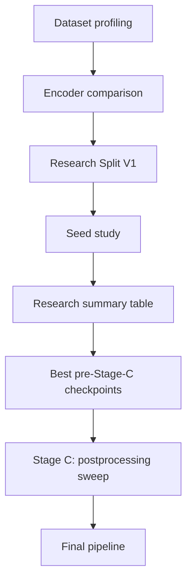
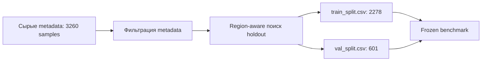

# Сегментация археологических объектов с DeepLabV3+

## Обзор проекта

Этот модуль `Geodata_Archaeology_CV` посвящен многоклассовой семантической сегментации археологических объектов на данных дистанционного зондирования.

 Произведено воспроизводимое ML-исследование.

 Каждый этап отвечает на отдельный вопрос:

 - какие данные наиболее информативны,
 - достаточно ли ResNet34,
 - как зафиксировать честный benchmark,
 - насколько результат зависит от seed,
 - можно ли улучшить извлечение объектов без повторного обучения нейросети.


**Итоговый pipeline**

| Компонент | Выбранное значение |
|---|---|
| Архитектура | DeepLabV3+ |
| Энкодер | ResNet34 |
| Модальности | `Li`, `Ae`, `SpOr` |
| Research split | `archaeology_5class_research_split_v1` |
| Seed | `101` |
| Confidence threshold | `0.3` |
| Минимальная площадь компоненты | `8 px` |
| Morphological opening | `True` |
| Validation weighted competition F1 | **0.7457** |


## Постановка задачи

Цель проекта — сегментировать пять классов археологических объектов на растровых patches и преобразовать предсказанные маски в отдельные полигоны, пригодные для дальнейшего геоанализа.

| ID | Класс |
|---:|---|
| 0 | `background` |
| 1 | `kurgany_tselye` |
| 2 | `kurgany_povrezhdennye` |
| 3 | `gorodishcha` |
| 4 | `fortifikatsii` |
| 5 | `arkhitektury` |

Это объектная задача. Pixel IoU полезен для диагностики границ, но не полностью отражает прикладное качество: грубый, но правильно локализованный полигон может быть полезнее аккуратного фрагмента маски. Поэтому для выбора модели используется взвешенный polygon-level competition F1.

| Группа метрик | Назначение |
|---|---|
| Pixel IoU, Dice, pixel accuracy | диагностика сегментации и анализ ошибок |
| Object precision, recall, F1 | оценка обнаруженных connected components |
| Weighted competition F1 | основная validation-метрика выбора pipeline |

Веса классов на объектном уровне:

| Класс | Вес |
|---|---:|
| `kurgany_povrezhdennye` | 27.8 |
| `kurgany_tselye` | 22.2 |
| `gorodishcha` | 16.7 |
| `arkhitektury` | 11.1 |
| `fortifikatsii` | 5.6 |

## Логика исследования



Следующий этап запускается только после ответа на вопрос предыдущего. Раннее сравнение энкодеров является диагностикой. Все основные выводы о финальной модели получены позднее на зафиксированном Research Split V1.

## Этап 1. Профилирование датасета

### Исследовательский вопрос

Какие данные доступны, насколько они сбалансированы и какие модальности содержат наиболее выразительную геометрию археологических объектов?

### Структура данных

Каждый patch хранится как одноканальный `.npy`-массив. Metadata содержит регион, модальность, исходный файл, геометрию crop и статистику по классам. Исходный датасет не публикуется в GitHub.

```text
segmentation_dataset/
├── metadata.csv
├── images/
│   └── 000001.npy
└── masks/
    └── 000001.npy
```

| Характеристика | Значение |
|---|---:|
| Сэмплы | 3260 |
| Регионы | 109 |
| Модальности | 4 |
| Foreground-классы | 5 |

### Примеры объектов


### Дисбаланс классов

| Класс | Сэмплы |
|---|---:|
| `kurgany_povrezhdennye` | 1822 |
| `kurgany_tselye` | 669 |
| `fortifikatsii` | 473 |
| `arkhitektury` | 218 |
| `gorodishcha` | 78 |


Поврежденные курганы доминируют среди patches. `gorodishcha` и `arkhitektury` представлены значительно реже, поэтому для них особенно важны аккуратная validation-оценка и дальнейший анализ ошибок.

### Распределение модальностей

| Модальность | Описание | Сэмплы |
|---|---|---:|
| `Ae` | аэрофотосъемка | 1274 |
| `SpOr` | спутниковый снимок / ортофотоплан | 976 |
| `Li` | растр на основе LiDAR | 934 |
| `Or` | дополнительный ортофотоплан | 76 |


Классы распределены по источникам неравномерно. Например, в сырых metadata нет `Li`-примеров класса `arkhitektury`. Редкая модальность `Or` сохранена в профиле исходного датасета, но итоговый мультимодальный pipeline использует три основные модальности: `Li`, `Ae`, `SpOr`.

### Сравнение Li, Ae и SpOr


Коллаж показывает один регион и один основной класс, представленные одновременно в `Li`, `Ae` и `SpOr`. Это региональные примеры, а не гарантированно выровненные по пикселям crops.

### Вывод этапа

**LiDAR содержит наиболее информативную геометрию археологических объектов.** При этом мультимодальные данные необходимо сохранить в исследовании: отдельные классы представлены в источниках неравномерно, а визуальные модальности могут дополнять LiDAR.

## Этап 2. Сравнение энкодеров и модальностей

### Гипотеза

Более глубокий ResNet50 может улучшить сегментацию, но его преимущество необходимо проверить отдельно для LiDAR и полного набора доступных на этом этапе модальностей.

### Эксперимент

На сырых metadata без дополнительной фильтрации были обучены четыре диагностические модели DeepLabV3+. Во всех запусках использовались image size `256`, batch size `8`, learning rate `1e-3`, CE + Dice loss и одинаковое распределение регионов между train и validation.

| Эксперимент | Энкодер | Модальности | Best epoch | Mean fg IoU | Pixel accuracy | Object F1 | Weighted F1 |
|---|---|---|---:|---:|---:|---:|---:|
| `resnet34_li` | ResNet34 | `Li` | 23 | 0.1510 | 0.5770 | 0.4195 | 0.3421 |
| `resnet50_li` | ResNet50 | `Li` | 40 | **0.1589** | 0.5943 | 0.6058 | 0.4832 |
| `resnet34_all` | ResNet34 | все | 45 | **0.1253** | 0.7300 | **0.7790** | **0.6603** |
| `resnet50_all` | ResNet50 | все | 50 | 0.1028 | **0.7425** | 0.7306 | 0.6299 |

### Интерпретация

На LiDAR ResNet50 дал небольшой прирост mean foreground IoU. На полном наборе модальностей преимущество исчезло: ResNet34 показал более высокий mean foreground IoU, object F1 и weighted F1. Увеличение глубины энкодера не дало устойчивого выигрыша.

Li-only validation-подмножество не содержит объектов `arkhitektury`, поэтому результаты этой серии нельзя использовать как итоговый benchmark. Их задача — выбрать разумное направление дальнейшего исследования.


### Вывод этапа

**ResNet34 выбран как основной энкодер проекта:** он показал более стабильный результат на мультимодальных данных и позволил сделать последующее исследование компактным.

## Этап 3. Research Split V1

### Мотивация

Диагностические эксперименты помогли выбрать энкодер, но для корректного сравнения следующих моделей потребовалась единая воспроизводимая среда оценки.

Research Split V1 был подготовлен один раз и сохранен как набор CSV-файлов. Сначала к сырым metadata применялась фильтрация, затем выполнялся region-aware поиск validation holdout. Во время обучения фильтрация повторно не запускается: модели используют уже материализованные frozen CSV.



### Правила протокола

- train и validation разделены по регионам;
- регионы не пересекаются между частями split;
- CSV-файлы фиксируются и переиспользуются;
- поиск validation-регионов нельзя пересчитывать во время сравнения моделей;
- model selection и postprocessing выполняются только на validation;
- настоящий held-out test split пока отсутствует.

### Конфигурация

| Параметр | Значение |
|---|---|
| Protocol | `archaeology_5class_research_split_v1` |
| Group column | `region` |
| Stratification | `class_name`, `modality` |
| Validation fraction | `0.2` |
| Minimum validation samples per class | `5` |
| Candidate trials | `5000` |
| Random state | `42` |
| Train samples | `2278` |
| Validation samples | `601` |
| Train regions | `74` |
| Validation regions | `30` |

```text
splits/archaeology_5class_research_split_v1/
├── train_split.csv
├── val_split.csv
├── split_config.json
└── split_stats.md
```

### Вывод этапа

**Research Split V1 создал воспроизводимую исследовательскую среду без утечки регионов.** Все следующие benchmark-запуски сравниваются только внутри этого протокола.

## Этап 4. Исследование seed

### Гипотеза

Один удачный запуск может быть следствием случайной инициализации. Перед выбором итоговой модели необходимо измерить разброс результатов при разных seeds.

### Эксперимент

Семейство моделей намеренно оставалось узким: DeepLabV3+ ResNet34. На frozen CSV Research Split V1 были обучены две группы моделей с seeds `13`, `21`, `42`, `77`, `101`:

- только `Li`;
- мультимодальные данные `Li`, `Ae`, `SpOr`.

Всего выполнено `10` сопоставимых benchmark-запусков. Значения ниже рассчитаны **до Stage C**: модели уже обучены на Research Split V1, но к их предсказаниям еще не применен подобранный postprocessing.

### Результаты для Li

| Seed | Best epoch | Weighted F1 | Object F1 | Precision | Recall | Mean fg IoU |
|---:|---:|---:|---:|---:|---:|---:|
| 13 | 33 | 0.6902 | 0.7522 | 0.7427 | 0.7620 | 0.1225 |
| 21 | 42 | 0.7151 | 0.7783 | 0.8333 | 0.7300 | 0.1276 |
| 42 | 19 | 0.6341 | 0.6176 | 0.6409 | 0.5960 | 0.1153 |
| 77 | 28 | 0.6727 | 0.7886 | 0.7527 | **0.8280** | **0.1393** |
| 101 | 43 | **0.7310** | **0.8276** | **0.8395** | 0.8160 | 0.1391 |

### Результаты для Li, Ae и SpOr

| Seed | Best epoch | Weighted F1 | Object F1 | Precision | Recall | Mean fg IoU |
|---:|---:|---:|---:|---:|---:|---:|
| 13 | 19 | 0.6620 | 0.6484 | **0.9609** | 0.4893 | 0.0862 |
| 21 | 24 | **0.6811** | 0.6802 | 0.9456 | 0.5312 | **0.0938** |
| 42 | 8 | 0.6778 | 0.6104 | 0.9252 | 0.4555 | 0.0813 |
| 77 | 36 | 0.6725 | 0.7072 | 0.9490 | 0.5635 | 0.0871 |
| 101 | 28 | 0.6700 | **0.7480** | 0.9540 | **0.6152** | 0.0859 |

### Интерпретация

Разброс результатов заметен в обеих группах. Лучший seed зависит от метрики: например, среди мультимодальных моделей seed `21` лидирует по weighted F1, а seed `101` — по object F1 и recall.

### Вывод этапа

**Результат существенно зависит от случайной инициализации.** Выбирать итоговую модель по одному обучению некорректно.

## Сводная таблица исследования

Короткая таблица показывает, как менялся лучший weighted F1 на каждом этапе.

| Этап | Лучший результат |
|---|---:|
| Encoder comparison | 0.6603 |
| Research Split V1 | 0.7310 |
| Stage C | **0.7457** |

Полная таблица из `18` строк с диагностическими моделями, benchmark-запусками и Stage C pipeline-вариантами вынесена в [`reports/research_summary.md`](reports/research_summary.md).

## Этап 5. Отбор checkpoints для Stage C

### Цель отбора

После seed study необходимо было выбрать небольшой набор перспективных checkpoints для настройки извлечения объектов без повторного обучения сети.

| Модальности | Checkpoint | Weighted F1 до Stage C | Причина включения |
|---|---|---:|---|
| `Li` | `resnet34_li_seed_101` | **0.7310** | лучший Li-only checkpoint |
| `Li`, `Ae`, `SpOr` | `resnet34_all_seed_21` | **0.6811** | лучший мультимодальный weighted F1 |
| `Li`, `Ae`, `SpOr` | `resnet34_all_seed_77` | 0.6725 | более высокий object recall |
| `Li`, `Ae`, `SpOr` | `resnet34_all_seed_101` | 0.6700 | лучший мультимодальный object F1 и recall |

### Вывод этапа

**Checkpoint с максимальным weighted F1 до Stage C не обязательно формирует лучший итоговый pipeline.** Для объектной задачи требуется отдельная настройка преобразования масок в полигоны.

## Этап 6. Stage C: подбор постпроцессинга

### Мотивация

Нейросеть возвращает вероятности классов для каждого пикселя. Для практического использования эти вероятности необходимо преобразовать в чистые связные объекты.

Stage C проверяет, насколько можно повысить object-level качество без повторного обучения модели.

### Параметры

**Confidence threshold** — минимальная уверенность модели, при которой пиксель считается частью объекта. Более низкое значение может повысить recall, но также добавить ложные срабатывания.

**Minimum component area** — фильтрация слишком маленьких связных областей. Она удаляет одиночные пиксели и мелкий шум, которые маловероятно являются археологическими объектами.

**Morphological opening** — последовательность эрозии и расширения маски. Она помогает убрать небольшие выступы, изолированные пиксели и шумные соединения между объектами.

### Пространство поиска

| Параметр | Значения |
|---|---|
| Confidence threshold | `0.0`, `0.1`, `0.2`, `0.3`, `0.4`, `0.5` |
| Minimum component area | `8`, `16`, `32`, `64`, `128`, `256` |
| Morphological opening | `False`, `True` |
| Комбинаций для каждого checkpoint | `72` |
| Validation-конфигураций для четырех checkpoints | `288` |

Все решения принимались только на validation. Test split для выбора модели не использовался.

### Результаты

| Checkpoint | Weighted F1 до Stage C | Лучший weighted F1 | Delta | Confidence | Min area | Opening |
|---|---:|---:|---:|---:|---:|---|
| `resnet34_li_seed_101` | 0.7310 | 0.7316 | +0.0006 | 0.3 | 8 | False |
| `resnet34_all_seed_21` | 0.6811 | 0.7246 | +0.0435 | 0.3 | 8 | True |
| `resnet34_all_seed_77` | 0.6725 | 0.6949 | +0.0224 | 0.3 | 8 | True |
| `resnet34_all_seed_101` | 0.6700 | **0.7457** | **+0.0757** | 0.3 | 8 | True |


### Вывод этапа

**Stage C изменил итоговый выбор модели.** Лучшим checkpoint до Stage C была Li-only модель, но самый сильный object-aware pipeline получен для мультимодальной ResNet34 с seed `101`.

## Key Findings

- LiDAR оказался наиболее информативной отдельной модальностью.
- ResNet34 показал более устойчивое поведение, чем ResNet50.
- Результат существенно зависит от seed.
- Object-level метрики важнее pixel IoU для прикладной задачи.
- Постпроцессинг способен изменить выбор лучшей модели.
- Лучший итоговый pipeline использует `Li`, `Ae`, `SpOr` и Stage C.

## Итоговый pipeline

| Компонент | Выбранное значение |
|---|---|
| Архитектура | DeepLabV3+ |
| Энкодер | ResNet34 |
| Входные каналы | 1 |
| Модальности | `Li`, `Ae`, `SpOr` |
| Split | `archaeology_5class_research_split_v1` |
| Seed | `101` |
| Confidence threshold | `0.3` |
| Minimum component area | `8 px` |
| Morphological opening | `True` |
| Validation weighted competition F1 | **0.7457** |

### Эффект Stage C

| Метрика | До Stage C | Итоговый pipeline |
|---|---:|---:|
| Weighted competition F1 | 0.6700 | **0.7457** |
| Object F1 | 0.7480 | **0.7995** |
| Object precision | **0.9540** | 0.9114 |
| Object recall | 0.6152 | **0.7120** |

Постпроцессинг немного снижает precision, но заметно улучшает recall и баланс объектных метрик. Сеть не переобучалась: улучшение получено только за счет корректной настройки polygon extraction.

### Per-class диагностика checkpoint до Stage C

| Класс | Pixel IoU | Pixel Dice | Object F1 |
|---|---:|---:|---:|
| `background` | 0.7625 | 0.8652 | n/a |
| `kurgany_tselye` | 0.0794 | 0.1471 | 0.7845 |
| `kurgany_povrezhdennye` | **0.2535** | **0.4045** | 0.7466 |
| `gorodishcha` | 0.0000 | 0.0000 | 0.4783 |
| `fortifikatsii` | 0.0840 | 0.1550 | **0.8039** |
| `arkhitektury` | 0.0127 | 0.0251 | 0.4706 |

Расхождение между pixel IoU и object F1 является центральным наблюдением проекта: правильно локализованные полигоны могут быть полезны, даже если маски не идеальны на уровне пикселей.

## Research Contributions

- Построен region-aware benchmark split без пересечения регионов между train и validation.
- Выполнено `14` обучений DeepLabV3+.
- Проведены `4` encoder/modality ablation experiments и `10` benchmark-запусков seed study.
- Выполнен Stage C sweep из `72` postprocessing configurations для каждого из `4` checkpoints.
- Разработан воспроизводимый pipeline object-level evaluation и извлечения полигонов.

## Ограничения и анализ ошибок

| Проблема | Наблюдение | Следующий шаг |
|---|---|---|
| Недосегментация редких классов | низкий IoU для `gorodishcha` и `arkhitektury` | class-aware sampling и выборочная проверка |
| Foreground-to-background collapse | заметно в confusion matrix | повысить recall без неконтролируемого роста false positives |
| Смешение целых и поврежденных курганов | классы имеют сходную морфологию | проверить границы классов и неоднозначные annotations |
| Дисбаланс модальностей | классы представлены в источниках неравномерно | исследовать modality-specific normalization |
| Отсутствие held-out test | model selection выполнен на validation | создать отдельный test protocol |
| Чувствительность к seed | обнаружена в десяти benchmark-запусках | сравнивать серии запусков, а не одиночные checkpoints |

## Воспроизводимость

### Структура репозитория

```text
03_multiclass_segmentation_deeplab/
├── assets/          # отобранные визуализации для README
├── arch_datasets/   # загрузка датасета и фильтрация metadata
├── configs/         # рецепты экспериментов
├── losses/          # CE, BCE и Dice combinations
├── models/          # DeepLabV3+ model factory
├── notebooks/       # Kaggle runners и reproduction notebooks
├── reports/         # полные исследовательские сводки
├── runs/            # локальные checkpoints и полные артефакты
├── scripts/         # обучение, evaluation, sweep и профилирование
├── splits/          # frozen benchmark CSV
├── utils/           # метрики, split helpers и postprocessing
└── requirements.txt
```

### Research Split V1

```bash
python scripts/create_research_split.py \
  --data-root ../datasets/segmentation_dataset \
  --out-dir splits/archaeology_5class_research_split_v1
```

Split уже зафиксирован в репозитории. Эту команду не следует повторно запускать во время сравнения моделей.

### Обучение

```bash
python scripts/train.py \
  --config configs/archaeology_5class_research_split_v1.yaml \
  --data-root ../datasets/segmentation_dataset \
  --out-dir runs/research_split_v1/resnet34_all_seed_101 \
  --task archaeology_5class \
  --encoder resnet34 \
  --modalities Li Ae SpOr \
  --seed 101 \
  --split frozen \
  --train-split-csv splits/archaeology_5class_research_split_v1/train_split.csv \
  --val-split-csv splits/archaeology_5class_research_split_v1/val_split.csv
```

### Object-level evaluation

```bash
python scripts/evaluate.py \
  --checkpoint runs/example/best_model.pth \
  --data-root ../datasets/segmentation_dataset \
  --out-dir runs/example \
  --task archaeology_5class \
  --encoder resnet34 \
  --split frozen \
  --train-split-csv splits/archaeology_5class_research_split_v1/train_split.csv \
  --val-split-csv splits/archaeology_5class_research_split_v1/val_split.csv \
  --eval-mode object
```

### README galleries

```bash
python -u scripts/generate_final_readme_visualizations.py \
  --data-root ../datasets/segmentation_dataset \
  --num-workers 0
```

Скрипт воспроизводимо формирует ranked galleries, before/after примеры и итоговые коллажи для README.

Отобранные для GitHub визуализации находятся в `assets/`. Сырые checkpoints, полные папки запусков, локальные архивы и датасеты остаются за пределами системы контроля версий. Рекомендации по очистке описаны в `PORTFOLIO_CLEANUP.md`.

## Дальнейшая работа

1. Добавить настоящий held-out test protocol.
2. Исследовать class-aware sampling для `gorodishcha` и `arkhitektury`.
3. Проверить modality-specific normalization для мультимодальной модели.
4. Добавить checksums snapshot датасета и lock-файл окружения.
6. Провести контролируемую sampler ablation без изменения frozen benchmark.

## Приложение: аудит ранних экспериментов

Ранние эксперименты использовали несовместимые validation-протоколы. Аудит выявил split mismatch и риск частичной validation leakage при сравнении legacy checkpoint с более поздними моделями. Эти результаты не включены в итоговый benchmark.

Подробные артефакты аудита сохранены локально в `runs/audit_old_baseline_resnet34/`. Research Split V1 был введен именно для того, чтобы дальнейшие сравнения оставались воспроизводимыми.
