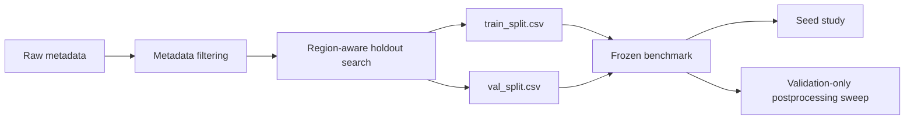

# Archaeological Object Segmentation with DeepLabV3+

## Project Overview

Research module of `Geodata_Archaeology_CV` for multiclass semantic segmentation of archaeological objects in remote-sensing rasters.

The project is organized as a reproducible ML study rather than a single notebook: it starts with a raw-data encoder and modality ablation, documents an experiment audit, freezes a region-aware benchmark split, measures seed variance, tunes object-aware postprocessing on validation data, and selects a final DeepLabV3+ model.

**Final validation result**

| Model | Modalities | Postprocessing | Weighted competition F1 |
|---|---|---|---:|
| DeepLabV3+ ResNet34 | all modalities | confidence `0.3`, min area `8`, opening `True` | **0.7457** |

This is an object-segmentation task: pixel metrics are retained for diagnostics, while the primary model-selection metric is polygon-level weighted competition F1.


## Dataset

Expected local dataset structure:

```text
segmentation_dataset/
├── metadata.csv
├── images/
│   └── 000001.npy
└── masks/
    └── 000001.npy
```

Each raster patch is stored as a one-channel `.npy` array. Metadata contains region, modality, source file, crop geometry and class statistics. The dataset itself is not committed to GitHub.

Available modalities:

| Modality | Description |
|---|---|
| `Li` | LiDAR-derived raster |
| `Ae` | aerial imagery-derived raster |
| `SpOr` | satellite / orthophoto-derived raster |
| `Or` | additional orthophoto-derived raster |

Mask labels:

| ID | Class |
|---:|---|
| 0 | `background` |
| 1 | `kurgany_tselye` |
| 2 | `kurgany_povrezhdennye` |
| 3 | `gorodishcha` |
| 4 | `fortifikatsii` |
| 5 | `arkhitektury` |

## Problem Statement

The objective is to segment five archaeological object classes against background using DeepLabV3+.

The central engineering question was not only how to improve pixel overlap. Archaeological interpretation depends on recovering objects: separate polygons, meaningful boundaries and a reasonable precision/recall balance. For this reason the project evaluates two complementary metric families:

| Metric family | Purpose |
|---|---|
| Pixel IoU, Dice, pixel accuracy | segmentation diagnostics and per-class error analysis |
| Object precision, recall, F1 | connected-component and polygon extraction quality |
| Weighted competition F1 | primary validation metric for model and postprocessing selection |

Object-level class weights:

| Class | Weight |
|---|---:|
| `kurgany_povrezhdennye` | 27.8 |
| `kurgany_tselye` | 22.2 |
| `gorodishcha` | 16.7 |
| `arkhitektury` | 11.1 |
| `fortifikatsii` | 5.6 |

## Research Timeline

### Phase 1. Encoder & Modality Ablation

The first diagnostic series compared encoder capacity and modality scope on raw metadata without filtering. All four runs used DeepLabV3+, image size `256`, batch size `8`, learning rate `1e-3`, CE + Dice loss and the same train/validation region assignment.

| Experiment | Encoder | Modalities | Mean foreground IoU | Pixel accuracy | Best epoch |
|---|---|---|---:|---:|---:|
| `resnet34_li` | ResNet34 | Li | 0.1510 | 0.5770 | 23 |
| `resnet50_li` | ResNet50 | Li | **0.1589** | 0.5943 | 40 |
| `resnet34_all` | ResNet34 | all | 0.1253 | 0.7300 | 45 |
| `resnet50_all` | ResNet50 | all | 0.1028 | **0.7425** | 50 |

Encoder comparison:

| Scope | ResNet34 mean fg IoU | ResNet50 mean fg IoU | ResNet50 - ResNet34 |
|---|---:|---:|---:|
| Li | 0.1510 | **0.1589** | +0.0080 |
| all modalities | **0.1253** | 0.1028 | -0.0225 |

Modality comparison:

| Encoder | Li mean fg IoU | All-modalities mean fg IoU | All - Li |
|---|---:|---:|---:|
| ResNet34 | **0.1510** | 0.1253 | -0.0256 |
| ResNet50 | **0.1589** | 0.1028 | -0.0561 |

**Finding:** LiDAR was the most informative raw-data modality. A larger encoder did not consistently improve the full multimodal task. The Li-only validation subset contains no `arkhitektury` objects, so this phase is diagnostic and not the publication benchmark.


### Phase 2. Audit

An unexpectedly strong legacy ResNet34 checkpoint triggered an experiment audit. The audit reconstructed the checkpoint recipe, checked copies by SHA-256 and compared the original validation protocol with newer evaluation scripts.

The key issue was a split mismatch:

| Check | Finding |
|---|---|
| Legacy checkpoint task | full `archaeology_5class`, not binary |
| Legacy validation regions | seven old-style regions |
| Later collected-model evaluation | different validation region set |
| Overlap with legacy train data | 189 samples |
| Main risk | partial validation leakage caused by protocol mismatch |

This explains why the same checkpoint appeared stronger under later evaluation. The result was not used as the final benchmark. Detailed audit artifacts are available in `runs/audit_old_baseline_resnet34/`.

### Phase 3. Research Split

The audit led to a frozen benchmark protocol: `archaeology_5class_research_split_v1`.



Split construction:

| Setting | Value |
|---|---|
| Group column | `region` |
| Stratification columns | `class_name`, `modality` |
| Validation fraction | `0.2` |
| Minimum validation samples per class | `5` |
| Candidate trials | `5000` |
| Random state | `42` |
| Train samples | 2278 |
| Validation samples | 601 |
| Train regions | 74 |
| Validation regions | 30 |
| Held-out test split | not available |

The CSV files are created once and reused. The region search must not be recalculated during model comparison.

```text
splits/archaeology_5class_research_split_v1/
├── train_split.csv
├── val_split.csv
├── split_config.json
└── split_stats.md
```

### Phase 4. Seed Study

The benchmark model family was intentionally narrow: DeepLabV3+ ResNet34 with the old recipe. Two modality groups were trained with seeds `13`, `21`, `42`, `77`, `101`.

ResNet34 all modalities:

| Seed | Best epoch | Weighted F1 | Object F1 | Precision | Recall | Mean fg IoU |
|---:|---:|---:|---:|---:|---:|---:|
| 13 | 19 | 0.6620 | 0.6484 | 0.9609 | 0.4893 | 0.0862 |
| 21 | 24 | **0.6811** | 0.6802 | 0.9456 | 0.5312 | 0.0938 |
| 42 | 8 | 0.6778 | 0.6104 | 0.9252 | 0.4555 | 0.0813 |
| 77 | 36 | 0.6725 | 0.7072 | 0.9490 | 0.5635 | 0.0871 |
| 101 | 28 | 0.6700 | **0.7480** | 0.9540 | **0.6152** | 0.0859 |

ResNet34 Li only:

| Seed | Best epoch | Weighted F1 | Object F1 | Precision | Recall | Mean fg IoU |
|---:|---:|---:|---:|---:|---:|---:|
| 13 | 33 | 0.6902 | 0.7522 | 0.7427 | 0.7620 | 0.1225 |
| 21 | 42 | 0.7151 | 0.7783 | 0.8333 | 0.7300 | 0.1276 |
| 42 | 19 | 0.6341 | 0.6176 | 0.6409 | 0.5960 | 0.1153 |
| 77 | 28 | 0.6727 | 0.7886 | 0.7527 | **0.8280** | **0.1393** |
| 101 | 43 | **0.7310** | **0.8276** | **0.8395** | 0.8160 | 0.1391 |

The seed study exposed meaningful stochastic variance. It also motivated a separate postprocessing comparison rather than selecting a final model from raw checkpoint scores alone.

### Phase 5. Postprocessing Sweep

Selected validation checkpoints were evaluated under a 72-configuration grid:

```text
confidence threshold × min component area × morphology opening
```

All decisions were made on validation data. No test split was used for model selection.

| Checkpoint | Raw weighted F1 | Best weighted F1 | Confidence | Min area | Opening |
|---|---:|---:|---:|---:|---|
| ResNet34 Li seed 101 | 0.7310 | 0.7316 | 0.3 | 8 | False |
| ResNet34 all seed 21 | 0.6811 | 0.7246 | 0.3 | 8 | True |
| ResNet34 all seed 77 | 0.6725 | 0.6949 | 0.3 | 8 | True |
| ResNet34 all seed 101 | 0.6700 | **0.7457** | 0.3 | 8 | True |

The sweep changed the final decision: the best raw checkpoint was Li-only, but the strongest object-aware pipeline was ResNet34 all modalities seed `101` after cleanup.

### Phase 6. Final Model

| Component | Selected value |
|---|---|
| Architecture | DeepLabV3+ |
| Encoder | ResNet34 |
| Input channels | 1 |
| Modalities | all available benchmark modalities |
| Split | `archaeology_5class_research_split_v1` |
| Seed | 101 |
| Confidence threshold | 0.3 |
| Minimum component area | 8 |
| Morphology opening | True |
| Validation weighted competition F1 | **0.7457** |

Before and after postprocessing:

| Metric | Raw checkpoint | Final pipeline |
|---|---:|---:|
| Weighted competition F1 | 0.6700 | **0.7457** |
| Object F1 | 0.7480 | **0.7995** |
| Object precision | **0.9540** | 0.9114 |
| Object recall | 0.6152 | **0.7120** |

Postprocessing trades a small amount of precision for substantially better recall and object-level balance.


## Results

Final selected checkpoint per-class diagnostics before Stage C cleanup:

| Class | Pixel IoU | Pixel Dice | Object F1 |
|---|---:|---:|---:|
| `background` | 0.7625 | 0.8652 | n/a |
| `kurgany_tselye` | 0.0794 | 0.1471 | 0.7845 |
| `kurgany_povrezhdennye` | **0.2535** | **0.4045** | 0.7466 |
| `gorodishcha` | 0.0000 | 0.0000 | 0.4783 |
| `fortifikatsii` | 0.0840 | 0.1550 | **0.8039** |
| `arkhitektury` | 0.0127 | 0.0251 | 0.4706 |

The divergence between pixel IoU and object F1 is central to the project: coarse but correctly localized polygons can be useful even when their masks are not pixel-perfect.

## Error Analysis

The main failure modes are:

| Failure mode | Evidence | Next step |
|---|---|---|
| Rare-class under-segmentation | low IoU for `gorodishcha` and `arkhitektury` | class-aware sampling and targeted review |
| Foreground-to-background collapse | visible in confusion matrices | improve recall without uncontrolled false positives |
| Whole vs damaged kurgan confusion | both kurgan classes share morphology | inspect class boundaries and ambiguous annotations |
| Modality imbalance | Li-only validation lacks `arkhitektury` | retain multimodal benchmark for final reporting |
| Split sensitivity | discovered during audit | keep frozen CSV artifacts immutable |

The repository keeps pixel metrics, polygon metrics, confusion matrices and curated prediction examples so that model selection remains interpretable.

## Repository Structure

```text
03_multiclass_segmentation_deeplab/
├── assets/
│   ├── dataset/
│   ├── predictions/
│   ├── failures/
│   ├── plots/
│   └── VISUAL_TODO.md
├── arch_datasets/
├── configs/
├── losses/
├── models/
├── notebooks/
├── runs/
├── scripts/
├── splits/
├── utils/
├── README.md
└── requirements.txt
```

Key commands:

```bash
pip install -r requirements.txt

python scripts/train.py \
  --config configs/archaeology_5class_research_split_v1.yaml \
  --data-root ../datasets/segmentation_dataset \
  --split frozen \
  --train-split-csv splits/archaeology_5class_research_split_v1/train_split.csv \
  --val-split-csv splits/archaeology_5class_research_split_v1/val_split.csv

python scripts/evaluate.py \
  --checkpoint runs/example/best_model.pth \
  --data-root ../datasets/segmentation_dataset \
  --out-dir runs/example \
  --task archaeology_5class \
  --split frozen \
  --train-split-csv splits/archaeology_5class_research_split_v1/train_split.csv \
  --val-split-csv splits/archaeology_5class_research_split_v1/val_split.csv
```

Curated visuals for GitHub live in `assets/`. Raw checkpoints, full run folders, local archives and datasets remain outside version control. Cleanup recommendations are documented in `PORTFOLIO_CLEANUP.md`.

## Future Work

1. Add a true held-out test protocol. Current model selection is validation-only.
2. Curate a compact qualitative gallery with best predictions and failure cases.
3. Investigate class-aware sampling for `gorodishcha` and `arkhitektury`.
4. Evaluate whether modality-specific normalization improves the multimodal model.
5. Add dataset snapshot checksums and an environment lock file.
6. Run a controlled sampler ablation after Stage C without changing the benchmark recipe.
