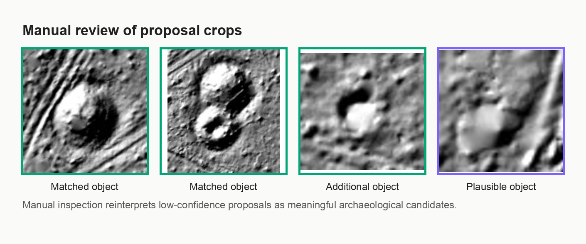

# Детекция археологических объектов по LiDAR

Этот модуль исследует object detection для археологических объектов на LiDAR-derived raster tiles.

В этой серии экспериментов целью ставилось максимально упростить задачу поиска археологических объектов с помощью применения наиболее простой модели детекции. Главный вывод:

```text
YOLO ограничен как финальный detector,
но полезен как low-confidence proposal generator для ручной проверки.
```

Рабочий пайплайн:

```text
LiDAR tiles -> YOLO detection -> proposal generation -> manual proposal audit
```


На validation image `000444` удобно проследить всю логику эксперимента:

```text
raw LiDAR -> ground truth -> standard detector -> low-confidence proposals -> manual review
```

В стандартном detector mode YOLO находит только часть размеченных объектов. При снижении confidence threshold появляются дополнительные археологически правдоподобные кандидаты. По результатам ручной проверки часть формальных false positives не является очевидным мусором. Поэтому модель лучше рассматривать как proposal generator для экспертного review, а не как автономный final detector.


## Problem

Задача - находить археологические объекты на LiDAR-изображениях с помощью bounding boxes.

Целевые морфологии:

- `kurgany_tselye`: хорошо сохранившиеся курганы;
- `kurgany_povrezhdennye`: поврежденные или слабо выраженные курганы;
- `gorodishcha`: площадные объекты типа городищ;
- `fortifikatsii`: линейные или площадные фортификационные структуры.

Эта постановка сложнее предыдущей segmentation-задачи: detector должен искать объекты на больших tiles с большим количеством фона. Объекты часто маленькие, слабоконтрастные, частично разрушенные или обрезанные границами тайлов. Часть рельефных структур вне разметки визуально похожа на археологические объекты.

## Dataset

Исходная база - YOLO bbox dataset, собранный из геопространственных растров и polygon-разметки археологических объектов. Финальный proposal-эксперимент использует LiDAR-only merged dataset:

```text
dataset_yolo_bbox_v3i_li_archaeological_object_merged
```

Все целевые классы объединены в один YOLO-класс:

```text
0: archaeological_object
```

Разбиение region-aware: validation regions отделены от train regions, чтобы избежать leakage по `region`, `source_id` и `raster_file`.

### v3i Dataset Split

| Split | Images | Positive images | Negative images | BBox |
|---|---:|---:|---:|---:|
| train | 408 | 237 | 171 | 1069 |
| val | 68 | 48 | 20 | 108 |
| total | 476 | 285 | 191 | 1177 |

Validation regions:

```text
004_ДЕМИДОВКА
005_ЛУБНО
006_МОСКОВИТЫ
011_РУНА
012_ЛИХУША
013_БЕРВЕНЕЦ
025_ШУМГОРА
037_КЧР
```

Validation bbox по исходным классам:

| Source class | Val bbox |
|---|---:|
| `fortifikatsii` | 47 |
| `kurgany_povrezhdennye` | 28 |
| `kurgany_tselye` | 20 |
| `gorodishcha` | 13 |

Leakage check:

| Key | Train/val overlap |
|---|---:|
| region | 0 |
| source_id | 0 |
| raster_file | 0 |

Validation image `000444` используется как сквозной пример в титульной figure: исходный LiDAR tile содержит несколько выраженных объектов и много близких по форме рельефных структур, а ground-truth bbox фиксируют только размеченную часть сцены.

## Research Questions

В ходе работы проверялись несколько практических гипотез:

- может ли YOLO работать как detector археологических объектов на LiDAR;
- лучше ли чистый Li-only dataset, чем более крупный Li + Ae dataset;
- улучшает ли recall расширение класса с `kurgan` до `archaeological_object`;
- помогает ли более длинное обучение;
- помогает ли смена YOLO-архитектуры;
- помогает ли увеличение размера изображения до `1024`;
- можно ли использовать low-confidence YOLO inference как proposal generation;
- могут ли простые правила снизить поток false positives;
- что ручная проверка говорит о формальных false positives.

## Experiments Overview

Ниже - краткая сводка экспериментов. Подробные логи сохранены в `reports/` и `runs/`.

| Experiment | Goal | Result | Conclusion |
|---|---|---|---|
| Early kurgan-only runs `v2-v4` | Получить рабочий detector для целых и поврежденных курганов | Лучший balanced v4 run: `mAP50 = 0.21359`, `Recall = 0.20424` | YOLO выучил часть сигнала, но recall остался низким. |
| Dataset ablation `v3b` vs `v3d` | Сравнить чистый Li-only dataset с более крупным Li + Ae | `v3b_li_medium`: `mAP50 = 0.33904`; `v3d_li_ae_medium`: `mAP50 = 0.16164` | Чистый Li-only оказался сильнее mixed-modality данных. |
| Longer training | Проверить, исправляют ли 400 epochs низкий recall | `v3b_400_epoch_limit`: `mAP50 = 0.27816`, ниже 100-epoch baseline | Большее число эпох не решило bottleneck. |
| YOLO26 check | Проверить более новую nano-архитектуру | `YOLO26n`: `mAP50 = 0.22218` на v3b | Замена архитектуры не улучшила baseline. |
| Manual-clean kurgan dataset `v3g` | Удалить битые tiles и плохие bbox перед обучением | `mAP50 = 0.20386`, `Recall = 0.20354` | Датасет стал честнее, но не проще для YOLO. |
| Curated validation `v3h` | Собрать ручной region-aware validation split | `mAP50 = 0.27114`; no-Saratov sanity check: `mAP50 = 0.46433` | Метрики сильно зависят от состава регионов. |
| Merged class `v3i` | Проверить one-class target `archaeological_object` | `mAP50 = 0.35723`, `Recall = 0.32407` | Широкий класс дал больше данных, но стал морфологически неоднородным. |
| Model and size ablation on v3i | Сравнить YOLOv8n/YOLO26n и `640/1024` | Лучший `mAP50`: YOLOv8n 640; лучший `mAP50-95`: YOLO26n 640 | `1024` не улучшил detection metrics. |
| Proposal mode | Снизить confidence, чтобы повысить candidate coverage | `conf=0.05`: `coverage@IoU0.3 = 0.639`; `conf=0.01`: `0.778` | YOLO полезен как proposal generator. |
| Proposal filtering | Проверить простые правила до ручного аудита | Лучшее общее правило удалило `30.9%` FP при потере `8.7%` covered GT | Правила помогают, но не решают semantic ambiguity. |
| Manual proposal audit | Проверить все v3i proposals при `conf=0.05` | Только `43 / 149` формальных FP оказались явным мусором/terrain | Стандартные detection metrics недооценивают практическую полезность. |

## Key Results

### Final Detector Mode

Самый сильный detector-style результат дал curated no-Saratov kurgan sanity check. Это полезная диагностическая точка, но validation там маленький и region-sensitive, поэтому такой результат нельзя считать универсальным решением.

| Dataset | Target | Model | imgsz | Val images | Val bbox | Precision | Recall | mAP50 | mAP50-95 |
|---|---|---|---:|---:|---:|---:|---:|---:|---:|
| `v3b_li_medium` | `kurgan` | YOLOv8n | 640 | 29 | 49 | 0.70544 | 0.28571 | 0.33904 | 0.11516 |
| `v3h_no_saratov` | `kurgan` | YOLOv8n | 640 | 31 | 66 | 0.68752 | 0.40909 | 0.46433 | 0.20339 |
| `v3i_archaeological_object` | `archaeological_object` | YOLOv8n | 640 | 68 | 108 | 0.65580 | 0.32407 | 0.35723 | 0.10604 |

Detector пока недостаточно надежен для полностью автоматического археологического картирования. Recall остается низким, а качество validation сильно зависит от состава регионов. На примере `000444` это видно в Panel C титульной figure: стандартный threshold находит часть размеченных объектов, но не покрывает всю сцену.

### Model and Image-Size Ablation on v3i

| Experiment | Model | imgsz | Best epoch | Precision | Recall | mAP50 | mAP50-95 |
|---|---|---:|---:|---:|---:|---:|---:|
| `v3i_yolov8n_img640` | YOLOv8n | 640 | 87 | 0.65580 | 0.32407 | 0.35723 | 0.10604 |
| `v3i_yolo26n_img640` | YOLO26n | 640 | 173 | 0.59923 | 0.34259 | 0.35024 | 0.15516 |
| `v3i_yolo26n_img1024` | YOLO26n | 1024 | 138 | 0.61251 | 0.26350 | 0.27636 | 0.11370 |
| `v3i_yolov8n_img1024` | YOLOv8n | 1024 | 141 | 0.58746 | 0.24074 | 0.27572 | 0.09563 |

`YOLOv8n 640` остался лучшим practical proposal baseline. `YOLO26n 640` улучшил строгую локализацию (`mAP50-95`), но не улучшил `mAP50` и proposal coverage. Увеличение image size до `1024` давало много визуально правдоподобных candidates, но не улучшило стандартные detection metrics.

### Proposal Mode

Для proposal generation самая полезная текущая модель:

```text
dataset = dataset_yolo_bbox_v3i_li_archaeological_object_merged
model   = YOLOv8n
imgsz   = 640
```

При low-confidence inference меняется сама роль YOLO. Вместо вопроса "является ли это финальным detector?" возникает более прикладной вопрос:

```text
Может ли YOLO создать управляемый список археологически осмысленных кандидатов?
```

| conf | Proposals | Proposals/image | TP | FP | FN | Recall@IoU0.5 | Coverage@IoU0.3 | Coverage@IoU0.5 | FP/image | Interpretation |
|---:|---:|---:|---:|---:|---:|---:|---:|---:|---:|---|
| 0.05 | 229 | 3.37 | 55 | 174 | 53 | 0.509 | 0.639 | 0.509 | 2.56 | Основной proposal mode для ручной проверки. |
| 0.01 | 989 | 14.54 | 71 | 918 | 37 | 0.657 | 0.778 | 0.657 | 13.50 | Aggressive mining mode, слишком шумный для прямого review. |

`conf=0.05` - текущая лучшая рабочая точка: модель покрывает много GT objects, но поток candidates еще достаточно мал для визуального аудита.

На том же `000444` low-confidence режим меняет интерпретацию результата: вместо небольшого набора строгих detections появляется управляемый набор candidates для экспертной проверки. После этого анализ смещается от качества final detector к практической ценности proposal workflow.

## Failure Analysis

### Object Size

В v3h false-negative audit использовалось рабочее правило совпадения:

```text
confidence >= 0.25 and IoU >= 0.5
```

| Group | Count | Median bbox area | Median width | Median height |
|---|---:|---:|---:|---:|
| FOUND | 24 | 32756 px | 182 px | 174.5 px |
| MISSED | 88 | 14994 px | 133 px | 118 px |

Пропущенные объекты часто меньше найденных, но не только маленькие. FN audit также выявил крупные подозрительные объекты, которые модель должна была бы видеть.

В false negatives чаще всего встречались признаки `small_object` (`50`), `large_object` (`38`), `edge_object` (`32`), `dense_cluster` (`25`) и `isolated_object` (`11`). По типу ошибки преобладали `metric_miss` (`43`), затем `hard_miss` (`28`) и `near_miss` (`17`). Во многих случаях модель генерирует prediction рядом с объектом, но его недостаточно для строгого detection matching.

### Region Effects

На полном v3h audit false negatives концентрировались в нескольких регионах:

| Region | FN count |
|---|---:|
| `028_САРАТОВ` | 44 |
| `008_СЕЛЯНЕ` | 17 |
| `019_ОСЕЧКИ_1` | 12 |
| `025_ШУМГОРА` | 8 |
| `037_КЧР` | 7 |

После переноса `028_САРАТОВ` из validation в train метрики kurgan detector резко выросли:

| Dataset | Train images | Val images | Val bbox | Precision | Recall | mAP50 | mAP50-95 |
|---|---:|---:|---:|---:|---:|---:|---:|
| `v3h_li_manual_curated_val` | 212 | 46 | 112 | 0.42761 | 0.24107 | 0.27114 | 0.12092 |
| `v3h_no_saratov` | 227 | 31 | 66 | 0.68752 | 0.40909 | 0.46433 | 0.20339 |

Этот результат не означает, что задача решена. Скорее это признак сильного влияния regional domain shift на validation outcome.

### Heterogeneous Morphology

Класс `archaeological_object` объединяет округлые курганы, поврежденные насыпи, площадные городища и линейные фортификации. Это увеличивает число training examples, но делает one-class detector морфологически неоднозначным.

В v3i regional audit при `conf=0.25` несколько регионов имели очень низкий recall:

| Region | GT | TP | FN | Recall | Dominant classes |
|---|---:|---:|---:|---:|---|
| `005_ЛУБНО` | 27 | 1 | 26 | 0.037 | `fortifikatsii; gorodishcha` |
| `037_КЧР` | 12 | 1 | 11 | 0.083 | `kurgany_povrezhdennye` |
| `006_МОСКОВИТЫ` | 22 | 3 | 19 | 0.136 | `fortifikatsii` |
| `025_ШУМГОРА` | 18 | 4 | 14 | 0.222 | mixed |
| `013_БЕРВЕНЕЦ` | 12 | 11 | 1 | 0.917 | kurgans |

Одна и та же модель может хорошо работать в одном регионе и почти проваливаться в другом.

## Manual Proposal Audit

Отдельно была проведена ручная проверка всех `229` v3i proposals при `conf=0.05`.

Manual labels:

| Label | Count |
|---|---:|
| `object` | 132 |
| `plausible_object` | 51 |
| `terrain_like` | 30 |
| `trash` | 13 |
| `bad_crop` | 3 |

Формальные false positives определялись так:

```text
max_iou_with_gt < 0.3
```

Всего было `149` формальных FP proposals. Ручная проверка разделила их так:

| Formal FP Category | Count |
|---|---:|
| `object` | 52 |
| `plausible_object` | 51 |
| `terrain_like + trash` | 43 |
| `bad_crop` | 3 |

Главное наблюдение:

```text
Только 43 из 149 формальных false positives оказались явным мусором или terrain-like объектами.
```

Большинство формальных false positives вручную классифицированы как археологические объекты или археологически правдоподобные структуры.

Для `000444` ручной audit особенно показателен: среди low-confidence proposals есть не только matched objects, но и additional objects, которые формально не совпадают с GT, однако выглядят археологически осмысленно.



Стандартные detection metrics в такой постановке занижают практическую полезность proposal generator. Многие "false positives" не обязательно являются ошибками модели: это могут быть недоразмеченные объекты, неоднозначные археологические структуры или признаки вне текущего GT definition.

## Proposal Filtering

Перед ручным аудитом были проверены простые rule-based filters. Они могут уменьшить поток candidates, но не решают semantic ambiguity: часть формальных FP археологически осмысленна.

| Filter | FP reduction | Covered GT loss | Interpretation |
|---|---:|---:|---|
| `bbox_area_norm > 0.1 AND conf < 0.15` | 30.9% | 8.7% | Лучшее универсальное правило. |
| `region in {025_ШУМГОРА, 004_ДЕМИДОВКА, 011_РУНА} AND conf < 0.1` | 37.6% | 7.2% | Лучшее region-aware правило. |

Rule-based filtering полезен для приоритизации review, но не заменяет экспертную интерпретацию candidates.

## Final Conclusions

1. YOLO ограничен как финальный detector для этой задачи.
   Стандартный recall остается низким, а качество сильно зависит от состава регионов и морфологии объектов.

2. Расширение класса до `archaeological_object` не сделало YOLO более сильным финальным detector.
   Класс стал более неоднородным: курганы, поврежденные курганы, городища и фортификации не имеют одной простой визуальной формы.

3. Low-confidence YOLO inference полезен как proposal generation.
   При `conf=0.05` модель дала `229` proposals на `68` validation images, `coverage@IoU0.3 = 0.639` и `3.37` proposals per image.

4. Ручной аудит изменил интерпретацию false positives.
   Из `149` формальных FP только `43` оказались явным мусором или terrain-like false positives.

5. Наиболее полезный сценарий использования на этом этапе:

```text
LiDAR -> YOLO proposal generation -> human review
```

Такой workflow имеет практический смысл для археологического review, даже если модель пока не является надежным автономным detector.

## Repository Structure

```text
04_detection_yolo/
├── README.md
├── assets/readme/
├── configs/
├── scripts/
├── app/
├── notebooks/
├── reports/
├── runs/
└── requirements.txt
```

`configs/` хранит воспроизводимые параметры, `scripts/` - сборку датасетов и proposal generation, `app/` - локальные audit/viewer tools, `reports/` - аналитические выводы и CSV, `assets/readme/` - иллюстрации README. Большие датасеты, веса моделей и полные training runs не входят в Git tracking.

## Future Work

Короткий список направлений, которые логично продолжать отдельно:

- собрать небольшой crop-level refinement classifier на основе manually reviewed proposals;
- дополнить разметку для `plausible_object` candidates;
- превратить proposal workflow в human-in-the-loop инструмент для археологического review.

Эти шаги выходят за рамки текущего detection/proposal исследования.
