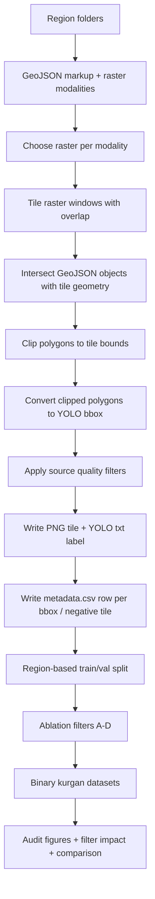

# YOLO Dataset Pipeline Inspection

## Pipeline Scheme

## Source Images

Images are generated by `scripts/build_yolo_dataset_bbox.py` from geospatial rasters discovered through `overlay_5_classes.find_regions(DATASET_ROOT)`. For each region and modality (`Li`, `Ae`, `SpOr`, `Or`), the script selects an available raster, tiles it with overlap, converts raster windows to RGB PNG tiles, and stores them under `images/train` or `images/val`.

## Labels and BBoxes

Vector markup is loaded from per-region GeoJSON files, reprojected to the raster CRS, intersected with each tile window, clipped to tile bounds, and converted to YOLO bbox format. The source class mapping is:

| Source class | YOLO id |
|---|---:|
| `kurgany_tselye` | 0 |
| `kurgany_povrezhdennye` | 1 |
| `gorodishcha` | 2 |
| `fortifikatsii` | 3 |
| `arkhitektury` | 4 |

The ablation datasets keep only `kurgany_tselye` and `kurgany_povrezhdennye`, remapped into a single `kurgan` class (`0`).

## Source Metadata

`metadata.csv` is written by the source generator with one row per bbox and one row for negative images. It stores split, region, modality, raster file, image/label paths, tile geometry, raster quality metrics, object count, bbox pixel coordinates, bbox area, and edge-touch flags.

## Split

The source split is region-based. The generator shuffles region names with `RANDOM_SEED = 42`, assigns `VAL_REGION_FRACTION = 0.2` to validation, and then all tiles from a region inherit that split. Ablation datasets preserve this split and do not create a new random image-level split.

## Negative Sampling

The source generator keeps negative tiles with `NEGATIVE_RATIO = 0.25`. In this ablation, `negative_ratio = 1.0` means at most one clean negative image per positive image, sampled with `RANDOM_SEED = 42`. Images where source kurgan objects exist but are removed by bbox filters are not converted into negatives.

## Existing Source Filters

The source generator already applies:

- minimum bbox area: `MIN_BBOX_AREA_PX = 80`;
- minimum valid raster fraction: `MIN_VALID_FRACTION = 0.35`;
- minimum raster standard deviation: `MIN_STD = 5`;
- minimum contrast: `MIN_P98_P2 = 10`;
- negative sampling;
- optional edge-object dropping is disabled in the current source generator.

## Leakage Risk

The intended leakage control is region-level splitting. The audit checks overlap by `region`, `source_id = region | modality | raster_file`, and `raster_file`.
