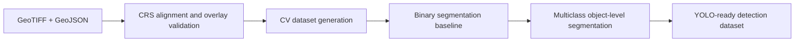

# Geodata Archaeology CV

End-to-end computer vision pipeline for archaeological remote sensing: from GeoTIFF + GeoJSON preprocessing to segmentation and detection-ready datasets.

## Overview

This repository combines geospatial preprocessing and computer vision research into one reproducible project series.

The pipeline covers:

- geospatial preprocessing;
- CRS-aware raster/vector alignment;
- patch and mask dataset generation;
- binary segmentation baseline;
- multiclass object-level segmentation;
- YOLO-ready detection dataset preparation.

The project is organized as a progression from raw geodata to ML-ready datasets, then to segmentation models and detection-oriented outputs.


## Pipeline



## Modules

| Stage | Module | Role | Key output |
|---|---|---|---|
| Geodata preprocessing | [`01_geodata_to_cv`](01_geodata_to_cv/) | CRS alignment, overlay validation, dataset generation | segmentation masks, YOLO-ready bbox data |
| Binary segmentation | [`02_unet_segmentation`](02_unet_segmentation/) | U-Net baseline for kurgan segmentation | best fg IoU = 0.6789 |
| Multiclass segmentation | [`03_multiclass_segmentation_deeplab`](03_multiclass_segmentation_deeplab/) | flagship DeepLabV3+ research module | weighted F1 = 0.7457 |
| Detection dataset | [`04_detection_yolo`](04_detection_yolo/) | YOLO-ready object detection dataset direction | coming soon |

## Key Results

- LiDAR is the strongest individual modality for archaeological object geometry.
- Binary U-Net established a strong kurgan segmentation baseline: foreground IoU = 0.6789.
- Multiclass DeepLabV3+ final pipeline reached weighted competition F1 = 0.7457.
- Region-aware validation was required for reliable model comparison.
- Object-level evaluation revealed errors hidden by pixel IoU.
- Postprocessing changed the final model ranking.

## Tech Stack

Python, PyTorch, DeepLabV3+, U-Net, YOLOv8 dataset format, Rasterio, GeoPandas, Shapely, NumPy, Pandas, Matplotlib.

## Repository Structure

```text
Geodata_Archaeology_CV/
├── 01_geodata_to_cv/
├── 02_unet_segmentation/
├── 03_multiclass_segmentation_deeplab/
├── 04_detection_yolo/
└── README.md
```

## Navigation

- [`01_geodata_to_cv`](01_geodata_to_cv/) - geodata preprocessing, CRS alignment, overlay validation and dataset generation.
- [`02_unet_segmentation`](02_unet_segmentation/) - binary U-Net segmentation baseline for kurgan detection.
- [`03_multiclass_segmentation_deeplab`](03_multiclass_segmentation_deeplab/) - multiclass DeepLabV3+ research project with region-aware validation and object-level evaluation.
- [`04_detection_yolo`](04_detection_yolo/) - detection dataset direction and YOLO-ready outputs.
