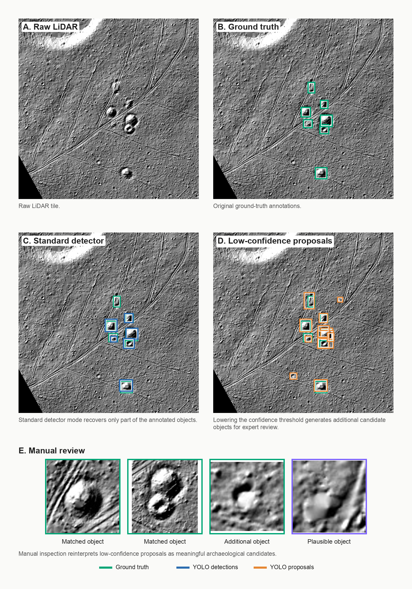

# Geodata Archaeology CV

End-to-end computer vision pipeline for archaeological remote sensing: from GeoTIFF + GeoJSON preprocessing to segmentation, object detection, and proposal-based review.

## Overview

This repository combines geospatial preprocessing and computer vision research into one reproducible project series.

The pipeline covers:

- geospatial preprocessing;
- CRS-aware raster/vector alignment;
- patch and mask dataset generation;
- binary segmentation baseline;
- multiclass object-level segmentation;
- YOLO object detection experiments;
- low-confidence proposal generation for expert review.

The project is organized as a progression from raw geodata to ML-ready datasets, then to segmentation models, detection experiments, and proposal-based archaeological review.



## Pipeline

| Step | Research step | Output |
|---|---|---|
| 01 | GeoTIFF + GeoJSON preprocessing | aligned rasters and vector labels |
| 02 | CRS alignment and overlay validation | verified geospatial overlays |
| 03 | CV dataset generation | image patches, masks, YOLO labels |
| 04 | Binary segmentation baseline | kurgan segmentation baseline |
| 05 | Multiclass segmentation | object-level segmentation model |
| 06 | YOLO object detection | detection baseline and error analysis |
| 07 | Proposal generation | low-confidence candidates for manual audit |

## Modules

| Stage | Module | Role | Key output |
|---|---|---|---|
| Geodata preprocessing | [`01_geodata_to_cv`](../../../01_geodata_to_cv/) | CRS alignment, overlay validation, dataset generation | segmentation masks, YOLO-ready bbox data |
| Binary segmentation | [`02_unet_segmentation`](../../../02_unet_segmentation/) | U-Net baseline for kurgan segmentation | best fg IoU = 0.6789 |
| Multiclass segmentation | [`03_multiclass_segmentation_deeplab`](../../../03_multiclass_segmentation_deeplab/) | flagship DeepLabV3+ research module | weighted F1 = 0.7457 |
| Object detection | [`04_detection_yolo`](../../../04_detection_yolo/) | YOLO detection research and proposal generation | coverage@IoU0.3 = 0.639 at conf=0.05 |

## Key Results

- LiDAR is the strongest individual modality for archaeological object geometry.
- Binary U-Net established a strong kurgan segmentation baseline: foreground IoU = 0.6789.
- Multiclass DeepLabV3+ final pipeline reached weighted competition F1 = 0.7457.
- Region-aware validation was required for reliable model comparison.
- Object-level evaluation revealed errors hidden by pixel IoU.
- Postprocessing changed the final model ranking.
- YOLO was limited as a final detector, but useful as a low-confidence proposal generator: 229 proposals on 68 validation images, coverage@IoU0.3 = 0.639 at conf=0.05.
- Manual audit of YOLO proposals showed that many formal false positives were archaeologically meaningful candidates rather than obvious noise.

## Tech Stack

Python, PyTorch, DeepLabV3+, U-Net, Ultralytics YOLO, YOLO dataset format, Rasterio, GeoPandas, Shapely, NumPy, Pandas, Matplotlib, Streamlit.

## Repository Structure

```text
Geodata_Archaeology_CV/
├── 01_geodata_to_cv/
├── 02_unet_segmentation/
├── 03_multiclass_segmentation_deeplab/
├── 04_detection_yolo/
└── README.md
```

## Navigation

- [`01_geodata_to_cv`](../../../01_geodata_to_cv/) - geodata preprocessing, CRS alignment, overlay validation and dataset generation.
- [`02_unet_segmentation`](../../../02_unet_segmentation/) - binary U-Net segmentation baseline for kurgan detection.
- [`03_multiclass_segmentation_deeplab`](../../../03_multiclass_segmentation_deeplab/) - multiclass DeepLabV3+ research project with region-aware validation and object-level evaluation.
- [`04_detection_yolo`](../../../04_detection_yolo/) - YOLO object detection research, threshold analysis, proposal generation and manual proposal audit.
